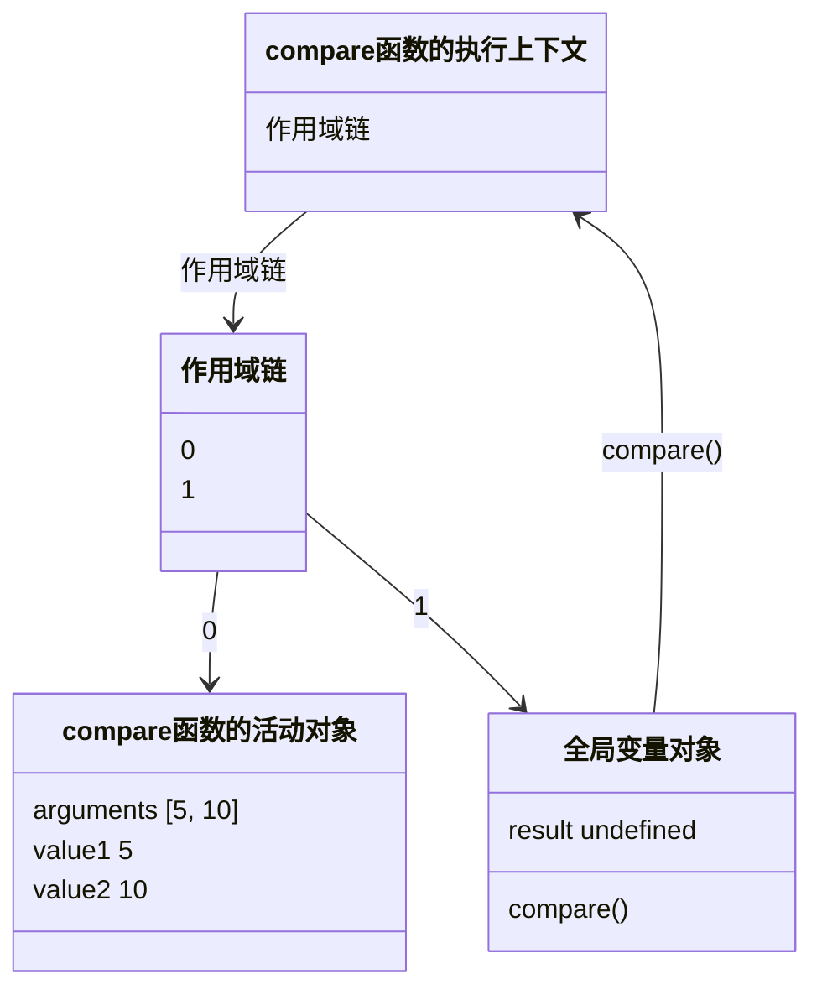

# 第 10 章 函数

函数实际上是对象。每个函数都是 `Function` 类型的实例，函数名就是指向函数对象的指针。

声明函数

```js
 function sum (num1, num2) {
     return num1 + num2;
 }
```

函数表达式

```js
let sum = function(num1, num2) {
    return num1 + num2;
};
```

箭头函数 (arrow function)

```js
let sum = (num1, num2) => {
    return num1 + num2;
};
```

还有一种是使用 `Function` 构造函数。接收任意多个字符串参数，最后一个参数始终会被当成函数体，而之前的参数都是新函数的参数

```js
let sum = new Function("num1", "num2", "return num1 + num2");  // 不推荐
```


## 10.1 箭头函数

ES6 新增了使用胖箭头 (=>) 语法定义函数表达式的能力

```js
let arrowSum = (a, b) => {
    return a + b;
};

let functionExpressionSum = function(a, b) {
    return a + b;
};

console.log(arrowSum(5, 8));  // 13
console.log(functionExpressionSum(5, 8));  // 13
```

箭头函数非常适合嵌入函数的场景

```js
let ints = [1, 2, 3];

console.log(ints.map(function(i) { return i + 1; }));  // [2, 3, 4]
console.log(ints.map((i) => { return i + 1; }));  // [2, 3, 4]
```

只有一个参数可以省略括号

```js
let triple = x => { return 3 + x; };

// 没有参数需要括号
let getRandom = () => { return Math.random(); };

// 多个参数需要括号
let sum = (a, b) => { return a + b; };
```


箭头函数可以省略花括号，如果省略后面就只能跟着一行代码，会直接返回后面一行代码的表达式结果

```js
let double = x => 3 * x;

// 可以赋值
let value = {};
let setName = x => x.name = "Matt";
setName(value);
console.log(value.name);  // "Matt"
```


但是，箭头函数不能使用 `arguments`、`super` 和 `new.target`，也不能用作构造函数。此外，箭头函数也没有 `prototype` 属性


## 10.2 函数名

函数名就是指向函数的指针，所以它们跟其他包含对象指针的变量具有相同的行为

```js
// 一个函数可以有多个名称
function sum(num1, num2) {
    return num1 + num2;
}

console.log(sum(10, 10));  // 20

let anotherSum = sum;
console.log(anotherSum(10, 10));  // 20

sum = null;
console.log(anotherSum(10, 10));  // 20
```


ES6 所有的函数对象都会暴露一个只读的 `name` 属性，保存的就是一个函数标识符，字符串话的变量名，即使函数没有名称也会显示成空串

```js
function foo() {}
let bar = function() {};
let baz = () => {};

console.log(foo.name);  // foo
console.log(bar.name);  // bar
console.log(baz.name);  // baz
console.log((() => {}).name);  // ""
console.log((new Function()).name);  // anonymous
```

获取函数、设置函数、或者 `bind()` 实例化，那么标识符前面会加上一个前缀

```js
function foo() {}

console.log(foo.bind(null).name);  // bound foo

let dog = {
    years: 1,
    get age() {
        return this.years;
    },
    set age(newAge) {
        this.years = newAge;
    }
};

let propertyDiscriptor = Object.getOwnPropertyDescriptor(dog, 'age');
console.log(propertyDiscriptor.get.name);  // get age
console.log(propertyDiscriptor.set.name);  // set age
```


## 10.3 理解参数

ECMAScript 函数既不关心传入参数的个数，也不关心参数的数据类型。

因为参数在函数内部表现为一个数组。

可以在函数内部访问 `arguments` 对象，是一个类数组对象（但不是 `Array` 实例）

```js
function sayHi() {
    console.log("Hello " + arguments[0] + ", " + arguments[1]);
}
```

ECMAScript 不存在验证命名参数的机制

`arguments` 对象可以跟命名参数混合使用

`arguments` 对象值始终会与对应的命名参数同步

```js
function doAdd(num1, num2) {
    arguments[1] = 10;
    console.log(arguments[0] + num2);
}
```

但是修改命名参数的值，不会影响 `arguments` 对象中相应的值

### 箭头函数中的参数

传给函数的参数不能使用 `arguments` 访问

```js
let bar = () => {
    console.log(arguments[0]);
};
bar(5);  // ReferenceError: arguments is not defined

// 可以包装函数中提供给箭头函数
function foo() {
    let bar = () => {
        console.log(arguments[0]);  // 5
    };
    bar();
}
foo(5);
```


## 10.4 没有重载

ECMAScript 函数没有签名，因为参数是由包含零个或多个值的数组表示的。没有函数签名，自然就没有重载

如果在 ECMAScript 中定义了两个同名函数，则后定义的会覆盖先定义

```js
function addSomeNumber(num) {
    return num + 100;
}

function addSomeNumber(num) {
    return num + 200;
}

let result = addSomeNumber(100);  // 300
```

第二个覆盖第一个定义

```js
// 类似例子
let addSomeNumber = function(num) {
    return num + 100;
};

addSomeNumber = function(num) {
    return num + 200;
};

let result = addSomeNumber(100);  // 300
```

## 10.5 默认参数值

在 ECMAScript 5.1 以前，实现默认参数的一种常用方式就是检测某个参数是否等于 `undefined`

```js
function makeKing(name) {
    name = (typeof name !== 'undefined') ? name : 'Henry';
    return `king ${name} Ⅷ`;
}

console.log(makeKing());  // 'King Henry Ⅷ';
console.log(makeKing('Louis'));  // 'King Louis Ⅷ';
```

ECMAScript 6 支持显式定义默认参数

```js
function makeKing(name = 'Henry') {
    return `King ${name} Ⅷ`;
}

console.log(makeKing());  // 'King Henry Ⅷ';
console.log(makeKing('Louis'));  // 'King Louis Ⅷ';
```

给参数传 `undefined` 相当于没有传值

```js
function makeKing(name = 'Henry', numerals = 'Ⅷ') {
    return `King ${name} ${numerals}`;
}
console.log(makeKing());  // King Henry Ⅷ
console.log(makeKing('Louis'));  // King Louis Ⅷ
console.log(makeKing(undefined, 'Ⅵ'));  // King Henry Ⅵ
```

使用默认参数，`arguments` 对象的值不反映参数的默认值，值反映传给函数的参数，修改命名参数也不会影响 `arguments` 对象，它始终以调用函数时传入的值为准

```js
function makeKing(name = 'Henry') {
    name = 'Louis';
    return `King ${arguments[0]}`;
}

console.log(makeKing());  // 'King undefined'
console.log(makeKing('Louis'));  // 'King Louis'
```

默认参数支持变量

```js
let romanNumerals = ['Ⅰ', 'Ⅱ', 'Ⅲ', 'Ⅳ', 'Ⅴ', 'Ⅵ']
let ordinality = 0;

function getNumerals() {
    return romanNumerals[ordinality++];
}

function makeKing(name = 'Henry', numerals = getNumerals()) {
    return `King ${name} ${numerals}`;
}

console.log(makeKing());  // King Henry Ⅰ
console.log(makeKing('Louis', 'ⅩⅥ'));  // King Louis ⅩⅥ
console.log(makeKing());  // King Henry Ⅱ
console.log(makeKing());  // King Henry Ⅲ
```

箭头函数也支持默认参数，但是只有一个参数时不能省略括号

```js
let makeKing = (name = 'Henry') => `King ${name}`;

console.log(makeKing());  // King Henry
```


### 默认参数作用域与临时性死区

给多个参数定义默认值实际上跟使用 `let` 关键字顺序声明变量一样

参数是按顺序初始化的，所以后定义默认值的参数可以引用先定义的参数

```js
function makeKing(name = 'Henry', numerals = name) {
    return `King ${name} ${numerals}`;
}

console.log(makeKing());  // King Henry Henry
```

前面定义的参数不能引用后定义的参数，否则会抛错

```js
// 报错
function makeKing(name = numerals, numerals = 'Ⅷ') {
    return `King ${name} ${numerals}`;
}
```

参数也存在于自己的作用域中，它们不能引用函数体的作用域

```js
// 报错
function makeKing(name = 'Henry', numerals = defaultNumeral) {
    var defaultNumeral = 'Ⅷ';
    return `King ${name} ${numerals}`;
}
```


## 10.6 参数扩展与收集

ECMAScript 6 新增了扩展操作符，既可用于调用函数时传参，也可以用于定义函数参数

### 10.6.1 扩展参数

传入多个参数

```js
let values = [1, 2, 3, 4];

function getSum() {
    let sum = 0;
    for (let i = 0; i < arguments.length; i++) {
        sum += arguments[i];
    }
    return sum;
}

// ES5
console.log(getSum.apply(null, values));  // 10
// ES6
console.log(getSum(...values));  // 10
// 在扩展操作符前后再加值
console.log(getSum(-1, ...values));  // 9
console.log(getSum(...values, 5));  // 15
console.log(getSum(-1, ...values, 5));  // 14
console.log(getSum(...values, ...[5, 6, 7]));  // 28
```

箭头函数也支持扩展操作符

```js
// 扩展操作符与参数默认值混合使用
function getProduct(a, b, c = 1) {
    return a * b * c;
}

let getSum = (a, b, c = 0) => {
    return a + b + c;
};

console.log(getProduct(...[1, 2]));  // 2
console.log(getProduct(...[1, 2, 3]));  // 6
console.log(getProduct(...[1, 2, 3, 4]));  // 6

console.log(getSum(...[0, 1]));  // 1
console.log(getSum(...[0, 1, 2]));  // 3
console.log(getSum(...[0, 1, 2, 3]));  // 3
```

### 10.6.2 收集参数

可以用扩展操作符把不同长度的独立参数组合为一个数组。收集到的参数的结果会得到一个 `Array` 实例

```js
function getSum(...values) {
    return values.reduce((x, y) => x + y, 0);
}

console.log(getSum(1, 2, 3));  // 6
```

收集参数只能作为最后一个参数，如果没有其余的参数则为空数组

```js
// 不可以
function getProduct(...values, lastValue) {}
// 可以
function ignoreFirst(firstValue, ...values) {
    console.log(values);
}
ignoreFirst();  // []
ignoreFirst(1);  // []
ignoreFirst(1, 2);  // [2]
ignoreFirst(1, 2, 3);  // [2, 3]
```

利用收集参数，可以让箭头函数实现与 `arguments` 一样的逻辑

```js
let getSum = (...values) => {
    return values.reduce((x, y) => x + y, 0);
}

console.log(getSum(1, 2, 3));  // 6
```

使用收集参数不影响 `arguments` 对象，它仍然反映调用时传给函数的参数

```js
function getSum(...values) {
    console.log(arguments.length);  // 3
    console.log(arguments);  // [1, 2, 3]
    console.log(values);  // [1, 2, 3]
}

console.log(getSum(1, 2, 3));
```


## 10.7 函数声明与函数表达式

JavaScript 引擎在加载数据时对函数声明和函数表达式是区别对待的。在任何代码执行前，会先读取函数声明，而函数表达式必须等到代码执行到它那一行才会在执行上下文中生成函数定义

```js
// 正常
console.log(sum(10, 10));
function sum(num1, num2) {
    return num1 + num2;
}
```

函数声明会在任何代码执行之前先被读取并添加到执行上下文。这个过程叫做**函数声明提升**(function declaration hoisting)

但是函数表达式就不能这样

```js
// 报错
console.log(sum(10, 10));
let sum = function(num1, num2) {
    return num1 + num2;
}

// 即使使用了 var 声明也一样
```

> **注意** 在使用函数表达式初始化变量时，可以给函数一个名称 `let sum = function sum() {};`

## 10.8 函数作为值

可以在一个函数中返回另一个函数

```js
function callSomeFunction(someFunction, someArgument) {
    return someFunction(someArgument);
}

function add10(num) {
    return num + 10;
}

let result1 = callSomeFunction(add10, 10);
console.log(result1);  // 20

function getGreeting(name) {
    return "Hello, " + name;
}

let result2 = callSomeFunction(getGreeting, "Nicholas");
console.log(result2);  // "Hello, Nicholas"
```

从一个函数返回另一个函数

```js
function createComparisonFunction(propertyName) {
    return function(object1, object2) {
        let value1 = object1[propertyName];
        let value2 = object2[propertyName];
        
        if (value1 < value2) {
            return -1;
        } else if (value1 > value2) {
            return 1;
        } else {
            return 0;
        }
    };
}

const data = [
    { name: "Zachary", age: 28 },
    { name: "Nicholas", age: 29 }
];

data.sort(createComparisonFunction("name"));
console.log(data[0].name);  // Nicholas
data.sort(createComparisonFunction("age"));
console.log(data[0].name);  // Zachary
```

## 10.9 函数内部

ES5：函数内部存在两个特殊对象，`arguments` 和 `this`

ES6：新增 `new.target` 属性

### 10.9.1 arguments

一个类数组对象，包含调用时传入的所有参数。这个对象只有以 `function` 关键字定义函数时才会有（也就是箭头函数没有）

`arguments` 对象还有一个 `callee` 属性，是一个指向 `arguments` 对象所在函数的指针

```js
// 阶乘函数，如果使用函数名进行递归就需要函数名一致才行
function factorial(num) {
    if (num <= 1) {
        return 1;
    } else {
        return num * factorial(num - 1);
    }
}

// 使用 arguments.callee 进行解耦
function factorial(num) {
    if (num <= 1) {
        return 1;
    } else {
        return num * arguments.callee(num - 1);
    }
}

let trueFactorial = factorial;
factorial = function() {
    return 0;
};

console.log(trueFactorial(5));  // 120
console.log(factorial(5));  // 0
```

### 10.9.2 this

在标准函数和箭头函数中有不同的行为

- **标准函数** `this` 引用的是把函数当前方法调用的上下文对象(在网页的全局上下文中调用函数时，`this` 指向 `windows`)
- **箭头函数** `this` 引用的是定义箭头函数的上下文

```js
window.color = 'red';
let o = {
    color: 'blue'
};

// 标准函数
function sayColor() {
    console.log(this.color);
}

sayColor();  // 'red'

o.sayColor = sayColor;
o.sayColor();  // 'blue'
```
```js
window.color = 'red';
let o = {
    color: 'blue'
};
// 箭头函数
let sayColor = () => console.log(this.color);

sayColor();  // 'red'

o.sayColor = sayColor;
o.sayColor();  // 'red'
```

- **在事件回调或定时器中** `this` 指向并非想要的对象，此时将箭头函数写成函数就可以解决问题

```js
function King() {
    this.royaltyName = 'Henry';
    // this 引用 King 的实例
    setTimeout(() => console.log(this.royaltyName), 1000);
}

function Queen() {
    this.royaltyName = 'Elizabeth';
    
    // this 引用 window 对象
    setTimeout(function() { console.log(this.royaltyName); }, 1000);
}
new King();  // Henry
new Queen();  // undefined
```


> **注意** 函数名只是保存指针的变量。


### 10.9.3 caller

ES5 给函数对象上添加一个属性：`caller`

```js
function outer() {
    inner();
}

function inner() {
    console.log(inner.caller);
}

outer();
```

如果要解耦，可以使用 `arguments.callee.caller` 来引用同样的值

在严格模式下访问 `arguments.callee` 会报错

### 10.9.4 new.target

ECMAScript 中的函数始终可以作为构造函数实例化一个新对象，也可以作为普通函数被调用

如果函数被正常调用，则 `new.target` 的值是 `undefined` 如果是 `new` 关键字调用的，则 `new.target` 将引用被调用的构造函数

```js
function King() {
    if (!new.target) {
        throw 'King must be instantiated using "new"';
    }
    console.log('King instantiated using "new"');
}
new King();  // King instantiated using "new"
King();  // Error: King must be instantiated using "new"
```

## 10.10 函数属性与方法

ECMAScript 中函数是对象。每个函数都有两个属性

- `length` 保存函数定义的命名参数的个数
- `prototype` 保存引用类型所有实例方法的地方

函数两个方法

- `call()` 改变函数体上下文中的 `this`
- `apply()` 改变函数体上下文中的 `this`

```js
window.color = 'red';
let o = {
    color: 'blue'
};

function sayColor() {
    console.log(this.color);
}

sayColor();  // red

sayColor.call(this);  // red
sayColor.call(window);  // red
sayColor.call(o);  // blue
```

ES5 新函数方法

- `bind()` 返回新函数实例，其 `this` 值会被绑定到传给 `bind()` 的对象

```js
window.color = 'red';
let o = {
    color: 'blue'
};

function sayColor() {
    console.log(this.color);
}

let objectSayColor = sayColor.bind(o);
objectSayColor();  // blue
```


## 10.11 函数表达式 

定义函数的两种方式

- 函数声明
- 函数表达式

函数声明会**函数声明提升**

```js
function functionName(arg0, arg1, arg2) {
    // 函数体
}

sayHi();
function sayHi() {
    console.log("Hi");
}
```

函数表达式

```js
let functionName = function(arg0, arg1, arg2) {
    // 函数体
}
```

函数表达式所创建的函数为**匿名函数（anonymous function）**

函数声明用在条件判断可能会有坑

```js
// 浏览器可能会在 condition 为 true 时直接返回第二个函数
if (condiction) {
    function sayHi() {
        console.log("Hi");
    }
} else {
    function sayHi() {
        console.log("Yo!");
    }
}
```

换成函数表达式可解决

```js
let sayHi;
if (condiction) {
    sayHi = function() {
        console.log("Hi");
    }
} else {
    sayHi = function() {
        console.log("Yo!");
    }
}
```


## 10.12 递归

**递归函数**通常的形式是一个函数通过名称调用自己

```js
function factorial(num) {
    if (num <= 1) {
        return 1;
    } else {
        return num * factorial(num - 1);
    }
}

// 如果把这个函数赋值给其它变量就会出问题
let anotherFactorial = factorial;
factorial = null;
console.log(anotherFactorial(4));  // 报错
```

可以用 `arguments.callee` 解决

```js
function factorial(num) {
    if (num <= 1) {
        return 1;
    } else {
        return num * arguments.callee(num - 1);
    }
}
```

但是严格模式下不能访问 `arguments.callee`

可以用命名函数表达式（named function expression）达到目的，在严格模式和非严格模式都能使用

```js
const factorial = (function f(num) {
    if (num <= 1) {
        return 1;
    } else {
        return num * f(num - 1);
    }
});
```


## 10.13 尾调用优化

ES6 规范新增了一项内存管理优化机制，让 JavaScript 引擎在满足条件时可重用栈帧。

非常适合“尾调用”，即外部函数的返回值是一个内部函数的返回值

```js
function outerFunction() {
    return innerFunction();  // 尾调用
}
```


在ES6优化后，执行这个例子会在内存中发生如下操作

1. 执行到 `outerFunction` 函数体，第一个栈帧被推到栈上。
2. 执行 `outerFunction` 函数体，到达 `return` 语句。为求值返回语句，必须先求 `innerFunction`。
3. 引擎发现把第一个栈帧弹出栈外也没问题，因为 `innerFunction` 的返回值也是 `outerFunction` 的返回值。
4. 弹出 `outerFunction` 的栈帧。
5. 执行到 `innerFunction` 的函数体，栈帧被推到栈上。
6. 执行 `innerFunction` 函数体，计算其返回值。
7. 将 `innerFunction` 的栈帧弹出栈外。

这种优化无论调用多少次嵌套函数，都只有一个栈帧

### 10.13.1 尾调用优化的条件

- 代码在严格模式下执行
- 外部函数的返回值是对尾调用函数的调用
- 尾调用函数返回后不需要执行额外的逻辑
- 尾调用函数不是引用外部函数作用域中自由变量的闭包

### 10.13.2 尾调用优化的代码

```js
function fib(n) {
    if (n < 2) {
        return n;
    }

    return fib(n - 1) + fib(n - 2);  // 不符合尾调用优化的条件，因为有相加操作
}

console.log(fib(0));  // 0
console.log(fib(1));  // 1
console.log(fib(2));  // 1
console.log(fib(3));  // 2
console.log(fib(4));  // 3
console.log(fib(5));  // 5
console.log(fib(6));  // 8
console.log(fib(1000));  // 崩溃
```

优化后

```js
// 优化后
"use strict";

// 基础框架
function fib(n) {
    return fibImpl(0, 1, n);
}

function fibImpl(a, b, n) {
    if (n === 0) {
        return a;
    }
    return fibImpl(b, a + b, n - 1);
}

console.log(fib(1000));  // 4.346655768693743e+208
```

## 10.14 闭包

**闭包**指的是哪些引用了另一个函数作用域中变量的函数

```js
function createComparisonFunction(propertyName) {
    return function(object1, object2) {
        let value1 = object1[propertyName];
        let value2 = object2[propertyName];
        
        if (value1 < value2) {
            return -1;
        } else if (value1 > value2) {
            return 1;
        } else {
            return 0;
        }
    }
}
```

外部函数的活动对象是内部函数作用域链上的第二个对象。这个作用域链一直向外串起了所有包含函数的活动对象，直到全局执行上下文才终止



在一个函数内部定义的函数会把其包含函数的活动对象添加到自己的作用域链中

```js
let compare = createComparisonFunction('name');
let result = compare({ name: 'Nicholas' }, { name: 'Greg' });
```


```mermaid
classDiagram
	class createComparisonFunction函数的执行上下文 {
		(作用域链)
	}
	class 匿名函数的执行上下文 {
		(作用域链)
	}
	class createComparisonFunction函数的执行上下文作用域链 {
		0
		1
	}
	class 匿名函数的执行上下文作用域链 {
		0
		1
		2
	}
	class 全局变量对象 {
		createComparisonFunction()
		result undefined
	}
	class createComparisonFunction的活动对象 {
		arguments ["name"]
		propertyName "name"
	}
	class 闭包的活动对象 {
		Object[] arguments
		object1
		object2
	}
	createComparisonFunction函数的执行上下文 --> createComparisonFunction函数的执行上下文作用域链 : (作用域链)
	匿名函数的执行上下文 --> 匿名函数的执行上下文作用域链 : (作用域链)
	createComparisonFunction函数的执行上下文作用域链 --> createComparisonFunction的活动对象 : 0
	createComparisonFunction函数的执行上下文作用域链 --> 全局变量对象 : 1
	匿名函数的执行上下文作用域链 --> 闭包的活动对象 : 0
	匿名函数的执行上下文作用域链 --> createComparisonFunction的活动对象 : 1
	匿名函数的执行上下文作用域链 --> 全局变量对象 : 2
```

> **注意** 因为闭包会保留它们包含函数的作用域，所以比其他函数更占用内存。过渡使用闭包可能会导致内存过渡占用，因此建议仅在十分必要时使用。


### 10.14.1 this 对象

闭包函数里面的 `this` 默认指向 `window`，严格模式下为 `undefined`

```js
window.indentity = 'The Window';

let object = {
    indentity: 'My Object',
    getIndentityFunc() {
        return function() {
            return this.indentity;
        };
    }
};

console.log(object.getIndentityFunc()());  // 'The Window'
```

由于 `this` 是指向函数调用时的对象，所以是 `window`

```js
window.indentity = 'The Window';

let object = {
    indentity: 'My Object',
    getIndentityFunc() {
        let that = this;
        return function() {
            return that.indentity;
        };
    }
};

console.log(object.getIndentityFunc()());  // 'My Object'
```

```js
window.indentity = 'The Window';

let object = {
    indentity: 'My Object',
    getIndentity() {
        return this.indentity;
    }
};

console.log(object.getIndentity());  // 'My Object'
console.log((object.getIndentity)());  // 'My Object'
// 赋值表达式的值是函数，括号中返回了一个函数，this 不再与任何对象绑定，执行了一次赋值，如果去掉括号，则还是 My Object
console.log((object.getIndentity = object.getIndentity)());  // 'The Window'
```


### 10.14.2 内存泄漏

IE9 之前如果把 HTML 元素保存在某个闭包的作用域，该元素就不能销毁

```js
function assignHandler() {
    let element = document.getElementById('someElement');
    element.onclick = () => console.log(element.id);
}
```

修复上述问题

```js
function assignHandler() {
    let element = document.getElementById('someElement');
    let id = element.id;

    element.onclick = () => console.log(id);
    
    element = null;
}
```


## 10.15 立即调用的函数表达式

**立即调用函数表达式**（IIFE，Immediately Invoked Function Expression）

可以模拟块级作用域

ES5 块级作用域

```js
(function() {
    // 块级作用域
    for (var i = 0; i < count; i++) {
        console.log(i);
    }
})();

console.log(i);  // 抛出错误
```

ES6 块级作用域

```js
// 内嵌块级作用域
{
    let i;
    for (i = 0; i < count; i++) {
        console.log(i);
    }
}
console.log(i);  // 抛出错误
```

```js
// 循环的块级作用域
for (let i = 0; i < count; i++) {
    console.log(i);
}
console.log(i);  // 抛出错误
```


## 10.16 私有变量

严格来讲 JavaScript 没有私有成员的概念，但是有**私有**变量的概念

任何定义在函数或块中的变量，都可以认为是私有的

- **特权方法（privileged method）**是能够访问函数私有变量的公有方法

  - 构造函数实现

    ```js
    function MyObject() {
        // 私有变量和私有函数
        let privateVariable = 10;
        
        function privateFunction() {
            return false;
        }
        
        // 特权方法
        this.publicMethod = function() {
            privateVariable++;
            return privateFunction();
        };
    }
    ```

    定义私有变量和特权方法

    ```js
    function Person(name) {
        this.getName = function() {
            return name;
        };
        
        this.setName = function(value) {
            name = value;
        };
    }
    
    let person = new Person('Nicholas');
    console.log(person.getName());  // 'Nicholas'
    person.setName('Greg');
    console.log(person.getName());  // 'Greg'
    ```

构造函数模式的缺点是每个实例都会重新创建一遍新方法。使用静态私有变量实现特权方法可以避免这种个问题


### 10.16.1 静态私有变量

私有作用域定义私有变量和函数来实现

```js
let Person;
(function() {
    let name = '';
    
    Person = function(value) {
        name = value;
    };
    
    Person.property.getName = function() {
        return name;
    };
    
    Person.property.setName = function(value) {
        name = value;
    };
})();

let person1 = new Person('Nicholas');
console.log(person1.getName());  // 'Nicholas'
person1.setName('Matt');
console.log(person1.getName());  // 'Matt'

let person2 = new Person('Michael');
console.log(person1.getName());  // 'Michael'
console.log(person2.getName());  // 'Michael'
```

> **注意** 使用闭包和私有变量会导致作用域链边长，影响性能
