# 第 17 章 事件

JavaScript 与 HTML 交互是通过**事件**实现的

可以使用仅在事件发生时执行的**监听器**（也叫处理程序）订阅事件。在传统软件工程领域，这个模型叫“观察者模式”

## 17.1 事件流

**事件流**描述了页面接收事件的顺序

- 事件冒泡流
- 事件捕获流

### 17.1.1 事件冒泡

IE 事件流被称为**事件冒泡**，事件被定义为从最具体的元素（文档树中最深的节点）开始出发，然后向上传播至没有那么具体的元素（文档）



### 17.1.2 事件捕获

Netscape Communicator 团队提出的**事件捕获流**。是最不具体的节点应该最先接受到事件，而最具体的节点应该最后接收到事件


### 17.1.3 DOM 事件流

DOM2 Events 规范规定事件流分为 3 个阶段：

- 事件捕获
- 到达目标
- 事件冒泡



## 17.2 事件处理程序

为响应事件而调用的函数被称为**事件处理程序**(或**事件监听器**)。名字以 `on` 开头，例如 `click` 事件的处理程序叫 `onclick`

### 17.2.1 HTML 事件处理程序

HTML 属性形式来指定事件处理程序

```html
<input type="button" value="Click Me" onclick="console.log('Clicked')" />
```

也可以调用页面其他地方定义的脚本

```html
<script>
  function showMessage() {
    console.log('Hello world!');
  }
</script>
<input type="button" value="Click Me" onclick="showMessage()" />
```

这个函数有一个特殊的局部变量 `event`，其中保存的就是 `event` 对象

```html
<!-- 输出 "click" -->
<input type="button" value="Click Me" onclick="console.log(event.type)" />
```

使用 HTML 指定时间会导致 HTML 与 JavaScript 强耦合

### 17.2.2 DOM0 事件处理程序

每个元素（包括 `window`、`document`）都有小写的事件处理程序属性，如 `onclick` ，只要把这个属性赋值为一个函数

```js
const btn = document.getElementById('myBtn');
btn.onclick = function() {
  console.log('Clicked');
};
```

事件处理程序会在元素的作用域中执行

```js
const btn = document.getElementById('myBtn');
btn.onclick = function() {
  console.log(this.id);  // "myBtn"
};

// 移除事件处理程序
btn.onclick = null;
```

### 17.2.3 DOM2 事件处理程序

接收3个参数：事件名、事件处理函数、一个布尔值，`true` 表示在捕获阶段调用事件处理程序，`false` (默认值) 表示在冒泡阶段调用事件处理程序

- `addEventListener()`
- `removeEventListener()`

```js
const btn = document.getElementById('myBtn');
btn.addEventListener('click', function() {
  console.log(this.id);  // "myBtn"
}, false);
```

使用 DOM2 事件处理程序的优势是可以为同一个事件添加多个处理程序

```js
const btn = document.getElementById('myBtn');
btn.addEventListener('click', function() {
  console.log(this.id);
}, false);
btn.addEventListener('click', () => {
  console.log('Hello world!');
}, false);
```

`removeEventListener()` 无法移除 `addEventListener()` 添加的匿名函数，只能移除具名函数

```js
const btn = document.getElementById('myBtn');
function handler() {
	console.log(this.id);
}
btn.addEventListener('click', handler, false);
btn.removeEventListener('click', handler, false);
```

