# 第 26 章 模块

在 ES6 模块规范出现之前，有类似的代码库基于 JavaScript 的语法和词法特性“伪造”出类似模块的行为

## 26.1 理解模块模式

将代码拆分成独立的块，然后再把这些块连接起来可以通过模块模式来实现。

背后的思想：把逻辑分块，各自封装，相互独立，每个块自行决定对外暴露什么，同时自行决定引入执行哪些外部代码。

### 26.1.1 模块标识符

模块系统本质上是键/值实体，其中每个模块都有个可用 于引用它的标识符。这个标识符在模拟模块的系统中可能是字符串，在原生实现的模块系统中可能是模块文件的实际路径。

原生浏览器模块标识符必须提供实际 JavaScript 文件的路径。除了文件路径，Node.js 还会搜索 node_modules 目录，用标识符去匹配包含 index.js 的目录。

### 26.1.2 模块依赖

模块系统的核心是管理依赖。

每个模块都会与某个唯一的标识符关联，该标识符可用于检索模块。这个标识符通常是 JavaScript 文件的路径，但在某些模块系统中，这个标识符也可以是在模块本身内部声明的命名空间路径字符串。

### 26.1.3 模块加载

当一个外部模块被指定为依赖时，本地模块期望在执行它时，依赖已准备好并已初始化。

在浏览器中，加载模块涉及几个步骤

- 加载模块涉及执行其中的代码，但必须是在所有依赖都加载并执行之后。
- 如果浏览器没有收到依赖模块的代码，则必须发送请求并等待网络返回。
- 收到模块代码之后，浏览器必须确定刚收到的模块是否也有依赖。
- 递归地评估并加载所有依赖，直到所有依赖模块都加载完成。只有整个依赖图都加载完成，才可以执行入口模块。

### 26.1.4 入口

相互依赖的模块必须指定一个模块作为入口（entry point），这也是代码执行的起点。模块化 JavaScript 应用程序的所有模块会构成依赖图。

可以通过有向图来表示应用程序中各模块的依赖关系。



这个应用程序的入口模块 A 必须在应用程序的其他部分加载后才能执行。

下面的脚本请求顺序能够满足依赖图的要求：

```html
<script src="moduleE.js"></script>
<script src="moduleD.js"></script>
<script src="moduleC.js"></script>
<script src="moduleB.js"></script>
<script src="moduleA.js"></script> 
```

模块加载是“阻塞的”，这意味着前置操作必须完成才能执行后续操作。

### 26.1.5 异步依赖

可以让 JavaScript 通知模块系统在必要时加载新模块，并在模块加载完成后提供回调。

```js
// 在模块 A 里面
load('moduleB').then(moduleB => {
  moduleB.doStuff();
});
```

只使用动态模块加载，那么使用一个 `<scirpt>` 标签即可完成模块 A 的加载。模块 A 会按需请求模块文件，而不会生成必需的依赖列表。

这样可以提高性能，因为在页面加载是只需同步加载一个文件

### 26.1.6 动态依赖

```js
if (loadCondition) {
  require('./moduleA');
}
```

在这个模块中，是否加载 `moduleA` 是运行时确定的。

动态依赖可以支持更复杂的依赖关系，但代价是增加了对模块进行静态分析的难度。

### 26.1.7 静态分析

对静态分析友好的模块系统可以让模块打包系统更容易将代码处理为较少的文件。

### 26.1.8 循环依赖

CommonJS、AMD 和 ES6 在内的所有模块系统都支持循环依赖。

在下面的模块代码中（其中使用了模块中立的伪代码），任何模块都可以作为入口模块，即使依赖 图中存在循环依赖：

```js
require('./moduleD');
require('./moduleB');

console.log('moduleA');
require('./moduleA');
require('./moduleC');

console.log('moduleB');
require('./moduleB');
require('./moduleD');

console.log('moduleC');

require('./moduleA');
require('./moduleC');

console.log('moduleD'); 
```

修改主模块中用到的模块会改变依赖加载顺序。

如果 `moduleA` 最先加载，则会按以下顺序输出

```js
moduleB
moduleC
moduleD
moduleA
```



如果 `moduleC` 最先加载，则会按以下顺序输出

```js
moduleD
moduleA
moduleB
moduleC
```



## 26.2 凑合的模块系统

ES6 之前会使用函数作用域和立即调用函数表达式（IIFE，Immediately Invoked Function Expression）将模块封装在匿名闭包中

 ```js
 (function() {
   // 私有 Foo 模块的代码
   console.log('bar');
 })();
 // bar
 ```

如果把这个模块的返回值赋给一个变量，那么实际上就为模块创建了命名空间

为了暴露公共 API，模块 IIFE 会返回一个对象，其属性就是模块命名空间中的公共成员

```js
var Foo = (function() {
  return {
    bar: 'baz',
    baz: function() {
      console.log(this.bar);
    }
  };
})();
```

还有一种模式叫作“泄露模块模式”（revealing module pattern）。这种模式只返回一个对象， 其属性是私有数据和成员的引用

```js
var Foo = (function() {
  var bar = 'baz';
  var baz = function() {
    console.log(bar);
  };

  return {
    bar: bar,
    baz: baz
  };
})();
```

在模块内部也可以定义模块，这样可以实现命名空间嵌套

```js
var Foo = (function() {
  return {
    bar: 'baz'
  };
})();
Foo.baz = (function() {
  return {
    qux: function() {
      console.log('baz');
    }
  };
})();
console.log(Foo.bar); // 'baz'
Foo.baz.qux(); // 'baz' 
```

为了让模块正确使用外部的值，可以将它们作为参数传给 IIFE

```js
var globalBar = 'baz';
var Foo = (function(bar) {
  return {
    bar: bar,
    baz: function() {
      console.log(bar);
    }
  };
})(globalBar);
console.log(Foo.bar); // 'baz' 
```

因为这里的模块实现其实就是在创建 JavaScript 对象的实例，所以完全可以在定义之后再扩展模块

无论模块是否存在，配置模块扩展以执行扩展也很有用

```js
// 扩展 Foo 以增加新方法
var Foo = (function(FooModule) {
  FooModule.baz = function() {
    console.log(FooModule.bar);
  };
  return FooModule;
})(Foo || {});
// 扩展 Foo 以增加新数据
var Foo = (function(FooModule) {
  FooModule.bar = 'baz';
  return FooModule;
})(Foo || {});
console.log(Foo.bar); // 'baz'
Foo.baz(); // 'baz'
```

自己动手写模块系统确实非常有意思，但实际开发中并不建议这么做，因为不够可靠

## 26.3 使用 ES6 之前的模块加载器

在 ES6 原生支持模块之前，需要单独的模块工具把这些模块语法与 JavaScript 运行时连接起来。这里的模块语法和连接方式有不同的表现形式，通常需要在浏览器中额外加载库或者在构建时完成预处理。

### 26.3.1 CommonJS

CommonJS 规范概述了同步声明依赖的模块定义。这个规范主要用于在服务器端实现模块化代码组织，但也可用于定义在浏览器中使用的模块依赖。CommonJS 模块语法不能在浏览器中直接运行。

CommonJS 模块定义需要使用 `require()` 指定依赖，而使用 `exports` 对象定义自己的公共 API

```js
var moduleB = require('./moduleB');
module.exports = {
  stuff: moduleB.doStuff();
}; 
```

在 Node.js 中，模块标识符可能指向文件，也可能指向包含 index.js 文件的目录

请求模块会加载相应模块，而把模块赋值给变量也非常常见，但赋值给变量不是必需的。调用 `require()` 意味着模块会原封不动地加载进来：

```js
console.log('moduleA');
require('./moduleA');  // "moduleA" 
```

无论一个模块在 `require()` 中被引用多少次，模块永远是单例。这是因为无论请求多少次，模块只会被加载一次。

```js
console.log('moduleA');
var a1 = require('./moduleA');
var a2 = require('./moduleA');
console.log(a1 === a2); // true 
```

模块第一次加载后会被缓存，后续加载会取得缓存的模块（如下代码所示）。模块加载顺序由依赖图决定。

```js
console.log('moduleA');
require('./moduleA');
require('./moduleB');  // "moduleA"
require('./moduleA'); 
```

`require()` 可以以编程方式嵌入在模块中，以下是动态加载依赖

```js
console.log('moduleA');
if (loadCondition) {
  require('./moduleA');
} 
```

在 Node.js 中可以使用绝对或相对路径，也可以使用安装在 `node_modules` 目录中依赖的模块标识符。

`module.exports` 对象非常灵活，有多种使用方式。如果只想导出一个实体，可以直接给  `module.exports` 赋值：

```js
module.exports = 'foo';
```

可以使用对象字面量赋值或每个属性赋一次值来实现

```js
module.exports = {
  a: 'A',
  b: 'B'
};

// 或者
module.exports.a = 'A';
module.exports.b = 'B'; 
```

模块的一个主要用途是托管类定义（这里使用 ES6 风格的类定义，不过 ES5 风格也兼容）

```js
class A {}
module.exports = A;

// 在别的文件
var A = require('./moduleA');
var a = new A();
```

也可以将类实例作为导出值：

```js
class A {}
module.exports = new A();
```

为了以正确的顺序打包模块，需要事先生成全面的依赖图

### 26.3.2 异步模块定义

遵循 AMD 规范的库：[RequireJs](https://requirejs.org/)

异步模块定义（AMD，Asynchronous Module Definition）的模块定义系统以浏览器为目标执行环境

AMD 的一般策略是让模块声明自己的依赖，而运行在浏览器中的模块系统会按需获取依赖，并在依赖加载完成后立即执行依赖它们的模块

与 CommonJS 不同，AMD 支持可选地为模块指定字符串标识符。

```js
// ID 为'moduleA'的模块定义。moduleA 依赖 moduleB，
// moduleB 会异步加载
define('moduleA', ['moduleB'], function(moduleB) {
  return {
    stuff: moduleB.doStuff();
  };
});
```

AMD 也支持 `require` 和 `exports` 对象

```js
define('moduleA', ['require', 'exports'], function(require, exports) {
  var moduleB = require('moduleB');
  exports.stuff = moduleB.doStuff();
});
// 动态依赖也是通过这种方式支持的
define('moduleA', ['require'], function(require) {
  if (condition) {
    var moduleB = require('moduleB');
  }
});
```

### 26.3.3 通用模块定义

通用模块定义（UMD，Universal Module Definition）规范可用于创建 CommonJS 和 AMD 都可以使用的模块代码。

UMD 定义的模块会在启动时检测要使用哪个模块系统，然后进行适当配置，并把所有逻辑包装在一个立即调用的函数表达式（IIFE）中。

```js
(function (root, factory) {
  if (typeof define === 'function' && define.amd) {
    // AMD 注册为匿名模块
    define(['moduleB'], factory);
  } else if (typeof module === 'object' && module.exports) {
    // Node 不支持严格 CommonJS
    // 但可以在 Node 这样支持 module.exports 的
    // 类 CommonJS 环境下使用
    module.exports = factory(require(' moduleB '));
  } else {
    // 浏览器全局上下文（root 是 window）
    root.returnExports = factory(root.moduleB);
  }
}(this, function (moduleB) {
  // 以某种方式使用 moduleB
  // 将返回值作为模块的导出
  // 这个例子返回了一个对象
  // 但是模块也可以返回函数作为导出值
  return {};
}));
```

开发时不应该期望手写这个包装函数，它应该由构建工具自动生成。开发者只需专注于模块的内容，而不必关心这些样板代码。

### 26.3.4 模块加载器终将没落

随着 ECMAScript 6 模块规范得到越来越广泛的支持，本节展示的模式最终会走向没落

## 26.4 使用 ES6 模块

ES6 引入了模块规范，这个规范全方位简化了之前出现的模块加载器，原生浏览器支持意味着加载器及其他预处理都不再必要。

### 26.4.1 模块标签及定义

带有 `type="module"` 属性的 `<script>` 标签会告诉浏览器相关代码应该作为模块执行

```html
<script type="module">
 // 模块代码
</script>
<script type="module" src="path/to/myModule.js"></script> 
```

JavaScript 模块文件没有专门的内容类型。

与传统脚本不同，所有模块都会像 `<script defer>` 加载的脚本一样按顺序执行。解析到 `<script type="module">` 标签后会立即下载模块文件，但执行会延迟到文档解析完成。

`<script type="module">` 在页面中出现的顺序就是它们执行的顺序。

```html
<!-- 第二个执行 -->
<script type="module"></script>
<!-- 第三个执行 -->
<script type="module"></script>
<!-- 第一个执行 -->
<script></script> 

<!-- 另外，可以改为加载外部 JS 模块定义 -->
<!-- 第二个执行 -->
<script type="module" src="module.js"></script>
<!-- 第三个执行 -->
<script type="module" src="module.js"></script>
<!-- 第一个执行 -->
<script></script> 
```

也可以给模块标签添加 `async` 属性。模块不会等待文档完成解析才执行。

同一个模块无论在一个页面中被加载多少次，实际上都只会加载一次

```html
<!-- moduleA 在这个页面上只会被加载一次 -->
<script type="module">
  import './moduleA.js';
</script>
<script type="module">
  import './moduleA.js';
</script>
<script type="module" src="./moduleA.js"></script>
<script type="module" src="./moduleA.js"></script> 
```

嵌入页面的模块定义中的代码不能被其他模块 `import`，只有通过外部文件加载的模块才可以使用 `import` 加载。因此，嵌入模块只适合作为入口模块。

### 26.4.2 模块加载

有些浏览器还没有原生支持 ES6 模块，因此可能还需要第三方工具。事实上，很多时候使用第三方工具可能会更方便。

完全支持 ECMAScript 6 模块的浏览器可以从顶级模块加载整个依赖图，且是异步完成的。

浏览器会解析入口模块，确定依赖，并发送对依赖模块的请求。

这些文件通过网络返回后，浏览器就会解析它 们的内容，确定它们的依赖，如果这些二级依赖还没有加载，则会发送更多请求。

这个异步递归加载过程会持续到整个应用程序的依赖图都解析完成。

解析完依赖图，应用程序就可以正式加载模块了。

如果 `moduleA` 依赖 `moduleB`，`moduleB` 依赖 `moduleC`。浏览器在对 `moduleB` 的请求完成之前并不知道要请求 `moduleC`。这种加载方式效率很高，也不需要外部工具，但加载大型应用程序的深度依赖图可能要花费很长时间。

### 26.4.3 模块行为

ECMAScript 6 模块借用了 CommonJS 和 AMD 的很多优秀特性

- 模块代码只在加载后执行
- 模块只能加载一次
- 模块是单例
- 模块可以定义公共接口，其他模块可以基于这个公共接口观察和交互
- 模块可以请求加载其他模块
- 支持循环依赖

ES6 模块系统增加了一些新行为

- ES6 模块默认在严格模式下执行
- ES6 模块不共享全局命名空间
- 模块顶级 `this` 的值是 `undefined`（常规脚本中是 `window`）
- 模块中的 `var` 声明不会添加到 `window` 对象
- ES6 模块是异步加载和执行的

与 `<script type="module">` 关联或者通过 `import` 语句加载的 JavaScript 文件会被认定为模块

### 26.4.4 模块导出

ES6 模块支持两种导出：命名导出和默认导出。

`export` 关键字用于声明一个值为命名导出。导出语句必须在模块顶级，不能嵌套在某个块中

```js
// 允许
export foo;
// 不允许
if (condition) {
  export foo;
}
```

`export` 关键字在模块中出现的顺序没有限制。`export` 语句甚至可以出现在它要导出的值之前

```js
// 允许
const foo = 'foo';
export { foo };
// 允许
export const foo = 'foo';
// 允许，但应该避免
export { foo };
const foo = 'foo'; 
```

行内命名导出

```js
export const foo = 'foo';
// 或者
const foo = 'foo';
export { foo };
```

导出时也可以提供别名，别名必须在 `export` 子句的大括号语法中指定，导入这个模块的外部模块可以使用 `myFoo` 访问导出的值

```js
const foo = 'foo';
export { foo as myFoo };
```

可以在一个模块中声明多个命名导出。导出的值可以在导出语句中声明，也可以在导出之前声明

```js
export const foo = 'foo';
export const bar = 'bar';
export const baz = 'baz';
```

部分或全部导出值指定别名

```js
const foo = 'foo';
const bar = 'bar';
const baz = 'baz';
export { foo, bar as myBar, baz };
```

**默认导出**使用 `default` 关键字将一个值声明为默认导出，每个模块只能有一个默认导出。重复的默认导出会导致 `SyntaxError`

```js
const foo = 'foo';
export default foo;
```

使用命名导出语法的 `default` 关键字

```js
const foo = 'foo';
// 等同于 export default foo;
export { foo as default };
```

ES6 支持在一个模块中同时定义这两种导出

```js
const foo = 'foo';
const bar = 'bar';
export { bar };
export default foo;
// 或者
const foo = 'foo';
const bar = 'bar';
export { foo as default, bar };
```

ES6 规范对不同形式的 `export` 语句规定了限制

```js
// 命名行内导出
export const baz = 'baz';
export const foo = 'foo', bar = 'bar';
export function foo() {}
export function* foo() {}
export class Foo {}

// 命名子句导出
export { foo };
export { foo, bar };
export { foo as myFoo, bar };

// 默认导出
export default 'foo';
export default 123;
export default /[a-z]*/;
export default { foo: 'foo' };
export { foo, bar as default };
export default foo
export default function() {}
export default function foo() {}
export default function*() {}
export default class {}
```

会导致错误的不同形式

```js
// 行内默认导出中不能出现变量声明
export default const foo = 'bar';

// 只有标识符可以出现在 export 子句中
export { 123 as foo };

// 别名只能在 export 子句中出现
export const foo = 'foo' as myFoo;
```

> **注意** 一般来说，声明、赋值和导出标识符最好分开。这样就不容易搞错了，同时也可以让 `export` 语句集中在一块

