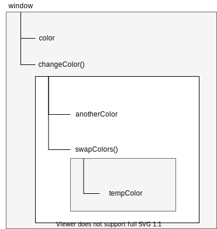

# 第 4 章 变量、作用域与内存

ECMA-262 规定，JavaScript 变量时松散类型的，而且变量不过就是特定时间点一个特定值的名称而已

变量的值和数据类型在脚本生命周期内可以改变

## 4.1 原始值与引用值

**原始值（primitive value）：**就是最简单的数据

**引用值（reference value）：**则是由多个值构成的对象

保存原始值的变量**按值（by value）**访问的

保存引用值的变量是**按引用（by reference）**访问的

JavaScript 不允许直接访问内存位置，也就是不能直接操作对象所在的内存空间。在操作对象时，实际上操作的是对该对象的**引用（reference）**而非实际的对象本身

> **注意** 在很多语言中，字符串是使用对象表示的，因此认为是引用类型，但是 ECMAScript 打破了这个惯例

### 4.1.1 动态属性

对于引用值，可以随时添加、修改、删除其属性

```js
let person = new Object();
person.name = "Nicholas";
console.log(person.name);  // "Nicholas"
```


原始值不能有属性，尽管给原始值添加属性不会报错

```js
let name = "Nicholas";
name.age = 27;
console.log(name.age);  // undefined
```


只有引用值可以动态添加属性


**原始类型**的初始化可以只使用原始字面量形式。如果使用 `new` 创建，则返回一个 `Object` 实例

两种方法的差异：

```js
let name1 = "Nicholas";
let name2 = new String("Matt");
name1.age = 27;
name2.age = 26;
console.log(name1.age);  // undefined
console.log(name2.age);  // 26
console.log(typeof name1);  // string
console.log(typeof name2);  // object
```


### 4.1.2 复制值

变量之间传值，如果是**原始值**，则会被复制到新的变量位置，也就是复制多一个副本，两个值互相独立

```js
let num1 = 5;
let num2 = num1;
```





如果是**引用值**，则为复制引用值的指针（对象的内存地址），它指向存储在堆内存中的对象。操作完成后，两个变量实际上指向同一个对象，所以一个对象变化会在另一个对象上反映出来

```js
let obj1 = new Object();
let obj2 = obj1;
obj1.name = "Nicholas";
console.log(obj2.name);  // "Nicholas"
// obj2 可以访问 Obj1 的对象
```




### 4.1.3 传递参数

ECMAScript 中所有函数的参数都是按值传递的。

原始值与原始值变量复制一样，引用值与引用值变量复制一样

```js
function addTen(num) {  // num 相当于局部变量
    num += 10;
    return num;
}

let count = 20;
let result = addTen(count);
console.log(count);  // 20，没有变化
console.log(result);  // 30
```


传递引用值

```js
function setName(obj) {
    obj.name = "Nicholas";
    obj = new Object();  // 这里相当于将局部变量 `obj` 指向一个新的对象，断开原来的指向，这个本地对象会在函数执行结束时销毁
    obj.name = "Greg";
}

let person = new Object();
setName(person);
console.log(person.name);  // "Nicholas"
```


> **注意** ECMAScript 中函数的参数就是局部变量

### 4.1.4 确定类型

`typeof` 适合用于判断字符串、数值、布尔值或 `undefined`

对象或 `null` 则返回 `"Object"`

```js
let s = "Nicholas";
let b = true;
let i = 22;
let u;
let n = null;
let o = new Object();
console.log(typeof s); // string
console.log(typeof i); // number
console.log(typeof b); // boolean
console.log(typeof u); // undefined
console.log(typeof n); // object
console.log(typeof o); // object
```


我们通常不关心一个值是不是对象，而是关心是什么类型的对象

可以使用 `instanceof`

```js
result = variable instanceof constructor
```

如果变量时给定引用类型的实例，则 `instanceof` 操作符返回 `true`

用 `instanceof` 检测**原始值**会返回 `false`

> **注意** `typeof` 用于检测函数时会返回 `"function"`。当在 Safari （直到 Safari 5）和 Chrome （直到 Chrome 7）中用于检测正则表达式时，也会返回 `"function"`。在 IE 和 Firefox 中，检测正则返回 `"object"`


## 4.2 执行上下文与作用域

每个上下文都有一个关联的**变量对象**（variable object），而这个上下文定义的所有变量和函数都存在于这个对象上。虽然无法通过代码访问变量对象，但后台处理数据会用到它。

在浏览器中，全局上下文就是 `window` 对象。所有通过 `var` 定义的全局变量和函数都会成为 `window` 对象的属性和方法。使用 `let` 和 `const` 则不会，但是在作用域链解析上效果是一样的。

ECMAScript 程序的执行流就是通过上下文栈进行控制的：

- 进入函数时，函数上下文被推到一个上下文栈上。
- 执行完函数以后，上下文栈会弹出该函数上下文，将控制权返还给之前的执行上下文。

上下文中的代码在执行的时候，会创建变量对象的一个**作用域链**（scope chain）。

代码正在执行的上下文的变量对象始终位于作用域链的最前端（有点像栈的先进先出，越靠上越前）

如果上下文是函数，其**活动对象**（activation object）用作变量对象。

作用域链中的下一个变量对象来自包含上下文，再下一个对象来自再下一个包含上下文。以此类推直至全局上下文；全局上下文的变量对象始终是作用域链的最后一个变量对象。

代码执行时标识符查找：作用域链的最前端开始，然后逐级往后，直到找到标识符（如果没有找到标识符，通常会报错）

```js
var color = "blue";

function changeColor() {
    let anotherColor = "red";
    
    function swapColors() {
        let tempColor = anotherColor;
        anotherColor = color;
        color = tempColor;
        // 这里可以访问 color、anotherColor 和 tempColor
    }
    // 这里可以访问 color 和 anotherColor，但访问不到 tempColor
    swapColors();
}
// 这里只能访问 color
changeColor();
```


**作用域链**




内部上下文可以通过作用域链访问外部上下文中的一切，但外部上下文无法访问内部上下文中的任何东西。

每个上下文都可以到上一级上下文中去搜索变量和函数，任何上下文都不能到下一级上下文中去搜索。

> **注意** 函数参数被认为是当前上下文中的变量，因此也跟上下文中的其他变量遵循相同的访问规则


### 4.2.1 作用域链增强

- 全局上下文
- 函数上下文
- `eval()` 调用内部存在第三种上下文
- 其他方式增强作用域链
  - `try/catch` 语句的 `catch` 块
  - `with` 语句

```js
function buildUrl() {
    let qs = "?debug=true";
    
    with(location) {
        let url = href + qs;  // location.href
    }
    
    return url;
}
```


### 4.2.2 变量声明

#### 1. 使用 var 的函数作用域声明

`var` 声明的变量会被自动添加到最接近的上下文。

```js
function add(num1, num2) {
    var sum = num1 + num2;
    return sum;
}

let result = add(10, 20);  // 30
console.log(sum);  // 报错
```


如果省略 `var`

```js
function add(num1, num2) {
    sum = num1 + num2;
    return sum;
}

let result = add(10, 20);  // 30
console.log(sum);  // 30
```


> **注意** 在初始化之前一定要先声明变量

`var` 声明的变量会被拿到函数或全局作用域的顶部，位于作用域中所有代码之前。这个现象叫作“提升”（hoisting）

```js
var name = "Jake";

// 等价于
name = "Jake";
var name;
```


#### 2. 使用 let 的块级作用域声明

ES6 新增的 `let` 关键字声明的变量，作用域是块级的。

块级作用域由最近的一对包含花括号 `{}` 界定

```js
{
    let d;
}
console.log(d);  // ReferenceError: d 没有定义
```


`let` 在同一个作用域不能声明两次。否则会抛出 `SyntaxError`

```js
var a;
var a;
// 不会报错
{
    let b;
    let b;
}
// SyntaxError: 标识符 b 已经声明过了
```


`let` 适合用于循环声明迭代变量，使用 `var` 会导致迭代变量会泄露到循环外部


#### 3. 使用 const 的常量声明

使用 `const` 声明的变量必须同时初始化为某个值。一经声明，在其生命周期的任何时候不能重新在赋予新值

赋值为对象的 `const` 变量不能再被重新赋值为其他引用值，但对象的键则不受限制。

```js
const o1 = {};
o1 = {};  // TypeError: 给常量赋值

const o2 = {};
o2.name = 'Jake';
console.log(o2.name);  // 'Jake'
```

如果想整个对象都不能修改，可以使用 `Object.freeze()`


#### 4. 标识符查找

当在特定上下文读写时要引用一个标识符时，必须通过搜索确定这个标识符表示什么。

搜索开始于作用域链前端。如果在局部上下文搜索到标识符则搜索停止，变量确定；如果没有找到，则继续沿作用域链搜索（作用域对象有原型链，可能会涉及到原型链。）这个过程直到搜索到全局上下文的变量对象，如果仍然没有找到，则说明未声明。

使用块级作用域声明并不会改变搜索流程，但可以给词法层级添加额外的层次：

```js
var color = 'blue';
function getColor() {
    let color = 'red';
    {
        let color = 'green';
        return color;
    }
}

console.log(getColor());  // 'green'
```

> **注意** 标识符搜索过程的性能消耗很低。但是访问局部变量比全局变量要快。由于 JavaScript 引擎在优化标识符查找上做了很多工作，所以这个差异微不足道


## 4.3 垃圾回收

执行环境负责在代码执行时管理内存，自动内存管理实现内存分配和闲置资源回收

两种标记策略：

- 标记清理
- 引用计数

### 4.3.1 标记清理

JavaScript 最常用的垃圾回收策略是**标记清理**（mark-and-sweep）

垃圾回收程序运行的时候，会标记内存中存储的所有变量（标记的方法有很多种）。然后，它会将所有在上下文中的变量，以及被在上下文中的变量**引用的变量**标记去掉。在此之后再被加上标记的变量就是待删除的了。随后垃圾回收程序做一次**内存清理**

### 4.3.2 引用计数

不常用的**引用计数**（reference counting）垃圾回收策略

声明变量并给它赋一个引用值时，这个值的引用数为 1。如果用一个值又被赋给另一个变量，那么引用计数加 1。如果保存对该值引用的变量被其他值给覆盖了，那么引用数减 1。当引用数为 0 时，就会被清除

但是这个会引起一个问题，**循环引用**，就是对象 A 有一个指针指向对象 B，而对象 B 也引用了对象 A

```js
function problem() {
    let objectA = new Object();
    let objectB = new Object();
    
    objectA.someOtherObject = objectB;
    objectB.anotherObject = objectA;
}
```

在 IE8 及更早版本的 IE 中，COM （Component Object Model 组件对象模型）对象也会去有引用计数的问题

可以手动切断引用

```js
myObject.element = null;
element.someObject = null;
```


### 4.3.3 性能

垃圾回收的时间调度很重要

无论什么时候开始收集垃圾，都能让它尽快结束工作

不能让垃圾回收程序长时间或频繁的运行

> **警告** 某些浏览器是有可能（但不推荐）主动触发垃圾回收的。在 IE 中，`window.CollectGarbage()` 在 Opera7+ 中，`window.opera.collect()`


### 4.3.4 内存管理

通常，分配给浏览器的内存要比分配给桌面软件的要少很多

将内存占用尽量保持在一个比较少的值可以让页面性能更好。

优化代码的手段：

- 只保存必要的数据，不比要的设置为 `null`，**解除引用**
- 建议用在全局变量和全局对象的属性
- 局部变量会在超出作用域后自动解除

#### 1. 通过 const 和 let 声明提升性能

这两个新关键字可能会更早地让垃圾回收程序介入，尽早回收应该回收的内存。在块作用域比函数作用域更早终止的情况下

#### 2. 隐藏类和删除操作

V8 在将解释后的 JavaScript 代码编译为实际的机器码时会利用“隐藏类”

```js
function Article() {
    this.title = 'Inauguration Ceremony Features Kazoo Band';
}

// 这里会共用同一个隐藏类
let a1 = new Article();
let a2 = new Article();

// 假设之后又添加了下面的代码
a2.author = 'Jake';  // 此时两个 Article 会对应两个不同的隐藏类，从而影响性能
```


避免 JavaScript 的“先创建再补充”（read-fire-aim）式的动态属性赋值，在构造函数中一次性声明所有属性

```js
function Article(opt_author) {
    this.title = 'Inauguration Ceremony Features Kazoo Band';
    this.author = opt_author;
}

let a1 = new Article();
let a2 = new Article('Jake');
```


使用 `delete` 也会带来上述问题

最佳实践就是把不想要的属性设置为 `null`

#### 3. 内存泄露

以外全局变量

```js
function setName() {
	name = 'Jake';  // 此时 name 是 window 的属性
}
```

使用 `var`、`let`、`const` 修复

定时器的内存泄露

```js
let name = 'Jake';
setInterval(() => {
    console.log(name);  // 这里的 name 会一直引用
}, 100);
```

闭包导致的内存泄露

```js
let outer = function() {
    let name = 'Jake';
    return function() {
        return name;  // 只要内部的函数没有被调用，则这个局部 name 会一直引用
    }
}
```


#### 4. 静态分配与对象池

减少浏览器执行垃圾回收的次数，开发者无法控制什么时候开始收集垃圾，但可以间接控制触发垃圾回收的条件

```js
// 如果函数被频繁调用，会导致垃圾回收频繁触发
function addVector(a, b) {
    let resultant = new Vetor();  // 这里频繁创建矢量对象了
    resultant.x = a.x + b.x;
    resultant.y = a.y + b.y;
    return resultant;
}
```


解决方案

```js
function addVector(a, b, resultant) {
    resultant.x = a.x + b.x;
    resultant.y = a.y + b.y;
    return resultant;
}
```


使用对象池。用来管理一组可回收的对象。应用程序可以向这个对象池请求一个对象、设置其属性、使用它，然后在操作完成后再把它还给对象池。由于没有发生对象初始化，垃圾回收探测就不会发现有对象更替

```js
let v1 = vectorPool.allocate();
let v2 = vectorPool.allocate();
let v3 = vectorPool.allocate();

v1.x = 10;
v1.y = 5;
v2.x = -3;
v2.y = -6;

addVector(v1, v2, v3);

console.log(v3.x, v3.y); // [7, -1]

vectorPool.free(v1);
vectorPool.free(v2);
vectorPool.free(v3);

v1 = null;
v2 = null;
v3 = null;
```


对象池按需分配矢量（在对象不存在时创建新的，在对象存在时则复用存在的），数组是比较好的选择

不过数组的动态分配很容易招致额外的垃圾回收

```js
let vectorList = new Array(100);
let vector = new Vector();
vectorList.push(vector);  // 引擎会删除大小为 100 的数组，再创建一个新的大小为 200 的数组
```


> **注意** 静态分配是优化的一种极端形式。如果你的程序被垃圾回收严重影响新能，可以考虑利用它来优化。否则在大多数情况下，这种属于过早优化