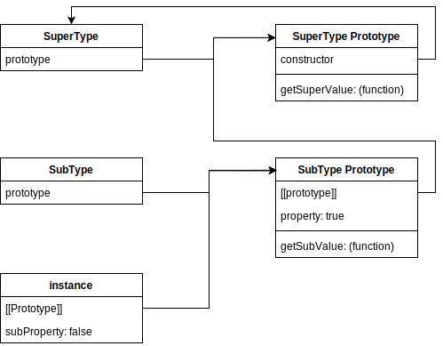

# 第 8 章 对象、类与面向对象编程

可以把 ECMAScript 的对象想象为一张散列表，其中的内容就是一组名/值对，值可以是数据或者函数

## 8.1 理解对象

使用 `Object` 构造函数创建

```js
let person = new Object();
person.name = "Nicholas";
person.age = 29;
person.job = "Software Engineer";
person.sayName = function() {
    console.log(this.name);
};
```


使用对象字面量创建对象（更加流行）

```js
let person = {
    name: "Nicholas",
    age: 29,
    job: "Software Enginner",
    sayName() {
        console.log(this.name);
    }
};
```


### 8.1.1 属性的类型

规范将两个中括号把特性的名称括起来，比如 `[[Enumerable]]`

属性分为：

- 数据属性
- 访问器属性

#### 1. 数据属性

- `[[Configurable]]` 表示属性是否可以通过 `delete` 删除并重新定义，默认值 `true`
- `[[Enumberable]]` 表示是否可以通过 `for-in` 循环返回，默认值 `true`
- `[[Writable]]` 表示属性的值是否可以被修改。默认值 `true`
- `[[Value]]` 包含属性的实际值。默认值 `undefined`

```js
/*
显式将属性添加到对象之后，[[Configurable]]、[[Enumberable]]、[[Writable]]、[[Value]]
都会被设置为 true
 */
let person = {
    name: "Nicholas"
};
```


修改默认特性：`Object.defineProperty(targetObj, propName, propDesc)`

```js
let person = {};
Object.defineProperty(person, "name", {
    writable: false,
    value: "Nicholas"
});
console.log(person.name);  // "Nicholas"
// 严格模式下会报错
person.name = "Greg";
console.log(person.name);  // "Nicholas"
```


如果对象中一个属性的 `[[Configurable]]` 设置为 `false`

- 不可 `delete` 此属性
- 不可再次对同一个属性调用 `Object.defineProperty()`

调用 `Object.defineProperty()` 默认的 `[[configurable]]` `[[enumerable]]` `[[writable]]` 默认为 `false`


#### 2. 访问器属性

不包含数据值。包含一个获取 (getter) 函数和一个设置 (setter) 函数

访问属性值时调用 getter，设置属性值时会调用 setter

- `[[configurable]]` 表示属性是否可以通过 `delete` 删除并重新定义，默认值 `true`
- `[[Enumberable]]` 表示是否可以通过 `for-in` 循环返回，默认值 `true`
- `[[Get]]` 获取函数，读取属性时调用。默认为 `undefined`
- `[[Set]]` 设置函数，写入属性时调用。默认为 `undefined`

```js
// 设置一个值会导致其他变化发生
let book = {
    year_: 2017,
    edition: 1
};

Object.defineProperty(book, "year", {
    get() {
        return this.year_;
    },
    set(newValue) {
        if (newValue > 2017) {
            this.year_ = newValue;
            this.edition += newValue - 2017;
        }
    }
});

book.year = 2018;
console.log(book.edition);  // 2
```


只定义获取函数 (getter) 说明这个属性时只读的，只有一个设置函数的属性是不能读取的


> **注意** 在 ES5 以前有两个非标准属性可以访问访问器属性: `__defineGetter__()` 和 `__defineSetter__()`


### 8.1.2 定义多个属性

`Object.defineProperties(targetObj, descObj)` 方法

```js
let book = {};
Object.defineProperties(book, {
    year_: {
        value: 2017
    },
    edition: {
        value: 1
    },
    year: {
        get() {
            return this.year_;
        },
        set(newValue) {
            if (newValue > 2017) {
                this.year_ = newValue;
                this.edition += newValue - 2017;
            }
        }
    }
});
```


### 8.1.3 读取属性的特性

`Object.getOwnPropertyDescriptor(targetObj, propName): descObj`

```js
let book = {};
Object.defineProperties(book, {
    year_: {
        value: 2017
    },
    edition: {
        value: 1
    },
    year: {
        get: function() {
            return this.year_;
        },
        set: function(newValue) {
            if (newValue > 2017) {
                this.year_ = newValue;
                this.edition += newValue - 2017;
            }
        }
    }
});
let descriptor = Object.getOwnPropertyDescriptor(book, "year_");
console.log(descriptor.value);  // 2017
console.log(descriptor.configurable);  // false
console.log(typeof descriptor.get);  // "undefined"
let descriptor1 = Object.getOwnPropertyDescriptor(book, "year");
console.log(descriptor1.value);  // undefined
console.log(descriptor1.enumerable);  // false
console.log(typeof descriptor1.get);  // "function"
```


 **ES2017:**  `Object.getOwnPropertyDescriptors()`

```js
let book = {};
Object.defineProperties(book, {
    year_: {
        value: 2017
    },
    edition: {
        value: 1
    },
    year: {
        get: function() {
            return this.year_;
        },
        set: function(newValue) {
            if (newValue > 2017) {
                this.year_ = newValue;
                this.edition += newValue - 2017;
            }
        }
    }
});
console.log(Object.getOwnPropertyDescriptors(book));

/*
{
    "year_": {
        "value":2017,
        "writable":false,
        "enumerable":false,
        "configurable":false
    },
    "edition": {
        "value":1,
        "writable":false,
        "enumerable":false,
        "configurable":false
    },
    "year":{
        "enumerable":false,
        "configurable":false
    }
}; 
*/
```


### 8.1.4 合并对象

把源对象所有的本地属性一起复制到目标对象上。有时候这种操作叫做混入 (mixin)

- `Object.assign()` 接收一个目标对象和一个或多个源对象作为参数，然后将每个原对象中可枚举和只有属性复制到目标对象

  这个方法会使用源对象上的 `[[Get]]` 取得属性的值，然后使用目标对象上的 `[[Set]]` 设置属性的值

  ```js
  let dest, src, result;
  
  /**  
   * 简单复制
   */
  dest = {};
  src = { id: 'src' };
  result = Object.assign(dest, src);
  
  // Object.assign 修改目标对象
  // 也会返回修改后的目标对象
  console.log(dest === result);  // true
  console.log(dest !== src);  // true
  console.log(result);  // { id: 'src' }
  console.log(dest);  // { id: 'src' }
  
  /**
   * 多个源对象
   */
  dest = {};
  
  result = Object.assign(dest, { a: 'foo' }, { b: 'bar' });
  
  console.log(result);  // { a: 'foo', b: 'bar' }
  
  /**
   * 获取函数与设置函数
   */
  dest = {
      set a(val) {
          console.log(`Invoked dest setter with param ${val}`);
      }
  };
  src = {
      get a() {
          console.log('Involed src getter');
          return 'foo';
      }
  };
  
  Object.assign(dest, src);
  
  /*
  调用 src 的获取方法
  调用 dest 的设置方法并传入参数 "foo"
  因为这里的设置函数不执行赋值操作
  所以实际上并没有把值转移过来
   */
  console.log(dest);  // { set a(val) {...} }
  ```


`Object.assign()` 实际上对每个源对象执行的是浅复制，如果多个源对象都有相同的属性，则使用最后一个复制的值

```js
/**
 * 覆盖属性
 */
let desc = { id: 'dest' };

let result = Object.assign(dest, { id: 'src1', a: 'foo' }, { id: 'src2', b: 'bar' });

// Object.assign 会覆盖重复的属性
console.log(result);  // { id: 'src2', a: 'foo', b: 'bar' }

desc = {};
src = { a: {} };
console.log(dest);  // { a: {} }
console.log(dest.a === src.a);  // true
```


`Object.assign()` 没有“回滚”操作，如果报错会中断复制，可能只会完成部分复制


### 8.1.5 对象标识及相等判定

ECMAScript 6 新增 `Object.is()`，与 `===` 很像，但同时也考虑了边界情况

```js
console.log(Object.is(true, 1));  // false
console.log(Object.is({}, {}));  // false
console.log(Object.is("2", 2));  // false

// 正确的 0、-0、+0 相等/不等判定
console.log(Object.is(+0, -0));  // false
console.log(Object.is(+0, 0));  // true
console.log(Object.is(-0, 0));  // false

// 正确的 NaN 相等判定
console.log(Object.is(NaN, NaN));  // true
```


递归检查超过两个值

```js
function recursivelyCheckEqual(x, ...rest) {
    return Object.is(x, rest[0]) && (rest.length < 2 || rescursivelyCheckEqual(...rest));
}
```


### 8.1.6 增强的对象语法

#### 1. 属性名简写

```js
let name = "Matt";

let person = {
    name
};

console.log(person);  // { name: "Matt" }
```


#### 2. 可计算属性

```js
const nameKey = "name";
const ageKey = "age";
const jobKey = "job";

const person = {
    [nameKey]: "Matt",
    [ageKey]: 27,
    [jobKey]: "Sofeware engineer"
};

console.log(person);  // { name: "Matt", age: 27, job: "Sofeware engineer" }
```


也可以是复杂的表达式

```js
const nameKey = "name";
const ageKey = "age";
const jobKey = "job";
let uniqueToken = 0;

function getUniqueKey(key) {
    return `${key}_${uniqueToken++}`;
}

const person = {
    [getUniqueKey(nameKey)]: "Matt",
    [getUniqueKey(ageKey)]: 27,
    [getUniqueKey(jobKey)]: "Sofeware engineer"
};

console.log(person);  // { name_0: "Matt", age_1: 27, job_2: "Sofeware engineer" }
```


> **注意** 可计算属性表达式在报错时没有回滚操作


#### 3. 简写方法名

```js
let person = {
    sayName(name) {
        console.log(`My name is ${name}`);
    }
};

person.sayName("Matt");  // My name is Matt

// 获取函数和设置函数同样适用
person = {
    name_: '',
    get name() {
        return this.name_;
    },
    set name(name) {
        this.name_ = name;
    },
    sayName() {
        console.log(`My name is ${this.name_}`);
    }
};

person.name = "Matt";
person.sayName();  // My name is Matt
```


同时可以与计算属性键相互兼容

```js
const methodKey = "sayName";

const person = {
    [methodKey](name) {
        console.log(`My name is ${name}`);
    }
};

person.sayName("Matt");  // My name is Matt
```


### 8.1.7 对象解构

ECMAScript 6 新增了对象解构语法，可以在一条语句中使用嵌套数据实现一个或多个赋值操作。

不使用对象解构

```js
const person = {
    name: "Matt",
    age: 27
};

const personName = person.name,
      personAge = person.age;
console.log(personName);  // Matt
console.log(personAge);  // 27
```


使用对象解构

```js
const person = {
    name: "Matt",
    age: 27
};

const { name: personName, age: personAge } = person;

console.log(personName);  // Matt
console.log(personAge);  // 27
```


解构赋值时定义默认值

```js
const person = {
    name: "Matt",
    age: 27
};

// 如果访问对象不存在的属性则默认是 undefined，除非赋默认值
const { name, job = 'Sofeware engineer' } = person;

console.log(name);  // Matt
console.log(job);  // Sofeware engineer
```


解构在内部使用函数 `ToObject()` (不能在运行时环境中直接访问) 把数据结构转换为对象。这意味着在对象解构的上下文中，原始值会被当成对象，但是 `null` 和 `undefined` 不能被解构，否则会抛出错误

```js
let { length } = 'foobar';
console.log(length);  // 6

let { constructor: c } = 4;
console.log(c === Number);  // true

let { _ } = null;  // TypeError
let { _ } = undefined;  // TypeError
```


预先声明的变量，对象解构赋值时要包在括号内部

```js
let personName, personAge;

let person = {
    name: "Matt",
    age: 27
};

({ name: personName, age: personAge } = person);

console.log(personName, personAge);  // Matt, 27
```


#### 1. 嵌套解构

```js
const person = {
    name: 'Matt',
    age: 27,
    job: {
        title: 'Sofeware engineer'
    }
};
const personCopy = {};

({
    name: personCopy.name,
    age: personCopy.age,
    job: personCopy.job
} = person);

// person.job 是对象引用，所以修改里面的属性 personCopy 也会影响
person.job.title = 'Hacker';

console.log(person);  // { name: 'Matt', age: 27, { title: 'Hacker' } }
console.log(personCopy);  // { name: 'Matt', age: 27, { title: 'Hacker' } }

// 嵌套结构
let { job: { title } } = person;

console.log(title);  // Hacker
```


#### 2. 部分解构

```js
const person = {
    name: 'Matt',
    age: 27
};

let personName, personBar, personAge;

try {
    // person.foo 是 undefined，会抛错
    ({ name: personName, foo: { bar: personBar }, age: personAge } = person)
} catch (err) {}

console.log(personName, personBar, personAge);  // Matt undefined undefined
```


#### 3. 参数上下文匹配

在函数参数列表中也可以进行解构赋值。对参数的解构赋值不会影响 `arguments` 对象

```js
const person = {
    name: 'Matt',
    age: 27
};

function printPerson(foo, { name, age }, bar) {
    console.log(arguments);
    console.log(name, age);
}

function printPerson2(foo, { name: personName, age: personAge }, bar) {
    console.log(arguments);
    console.log(personName, personAge);
}

printPerson('1st', person, '2nd');
// ['1st', { name: 'Matt', age: 27 }, '2nd']
// 'Matt', 27

printPerson2('1st', person, '2nd');
// ['1st', { name: 'Matt', age: 27 }, '2nd']
// 'Matt', 27
```


## 8.2 创建对象

使用 `Object` 构造函数或字面量对象可以方便的创建对象，但是有不足：创建具有相同接口的多个对象需要重复编写很多代码

### 8.2.1 概述

ES6 开始正式支持类和继承，ES6 的类都仅仅是封装了 ES5.1 构造函数加原型继承的语法糖而已

### 8.2.2 工厂模式

工厂模式用于抽象创建特定对象的过程。

按照特定接口创建对象的方式：

```js
function createPerson(name, age, job) {
    const o = new Object();
    o.name = name;
    o.age = age;
    o.job = job;
    o.sayName = function() {
        console.log(this.name);
    };
    return o;
}

const person1 = createPerson("Nicholas", 29, "Sofeware Enginner");
const person2 = createPerson("Greg", 27, "Doctor");
```

工厂模式虽然可以解决创建多个类似对象的问题，但是没有解决对象标识问题 (即新创建的对象是什么类型)

### 8.2.3 构造函数模式

ECMAScript 中的构造函数是用于创建特定类型对象的。

```js
function Person(name, age, job) {
    this.name = name;
    this.age = age;
    this.job = job;
    this.sayName = function() {
        console.log(this.name);
    };
}

const person1 = new Person("Nicholas", 29, "Sofeware Enginner");
const person2 = new Person("Greg", 27, "Doctor");

person1.sayName();  // Nicholas
person2.sayName();  // Greg

console.log(person1.constructor === Person);  // true
console.log(person2.constructor === Person);  // true

// constructor 本来是用于表示对象类型的。不过，一般认为 instanceof 操作符是确定对象类型更可靠的方式
console.log(person1 instanceof Object);  // true
console.log(person1 instanceof Person);  // true
console.log(person2 instanceof Object);  // true
console.log(person2 instanceof Person);  // true
```

构造函数模式与工厂模式的区别

- 没有显示地创建对象
- 属性和方法直接赋值给了 `this`
- 没有 `return`

构造函数名要按照惯例，首字母大写

要创建 `Person` 实例，应使用 `new` 操作符。以这种方式调用构造函数会执行以下操作

1. 在内存中创建一个对象
2. 这个对象内部的 `[[Prototype]]` 特性被赋值为构造函数的 `prototype` 属性
3. 构造函数内部的 `this` 被赋值为这个新对象 (即 `this` 指向新对象)
4. 执行构造函数内部的代码 (给新对象添加属性)
5. 如果构造函数返回非空对象，则返回该对象；否则，返回刚创建的新对象

在实例化时，如果不想传参数，那么构造函数后面的括号可以不加 (不推荐)。只要有 `new` 操作符，就可以调用相应的构造函数

```js
function Person() {
    this.name = "Jake";
    this.sayName = function() {
        console.log(this.name);
    };
}

const person1 = new Person();
const person2 = new Person;  // 不推荐

person1.sayName();  // Jake
person2.sayName();  // Jake

console.log(person1 instanceof Object);  // true
console.log(person1 instanceof Person);  // true
console.log(person2 instanceof Object);  // true
console.log(person2 instanceof Person);  // true
```

#### 1. 构造函数也是函数

任何函数只要使用 `new` 操作符调用就是构造函数，而不使用 `new` 操作符调用的函数就是普通函数

```js
function Person(name, age, job) {
    this.name = name;
    this.age = age;
    this.job = job;
    this.sayName = function() {
        console.log(this.name);
    };
}

// 作为构造函数
const person = new Person("Nicholas", 29, "Sofeware Enginner");
person.sayName();  // Nicholas

// 作为函数调用
Person("Greg", 27, "Doctor");  // 添加到 window 对象
window.sayName();  // "Greg"

// 在另一个对象的作用域中调用
const o = new Object();
Person.call(o, "Kristen", 25, "Nurse");
o.sayName();  // "Kristen"
```


#### 2. 构造函数的问题

构造函数的问题在于，其定义的方法会在每个实例上都会创建一遍。

我们知道，ECMAScript 中的函数时对象，因此每次定义函数时，都会初始化一个对象

```js
function Person(name, age, job) {
    this.name = name;
    this.age = age;
    this.job = job;
    this.sayName = function() {
        console.log(this.name);
    };
}

const person1 = new Person("Nicholas", 29, "Sofeware Enginner");
const person2 = new Person("Greg", 27, "Doctor");

console.log(person1.sayName === person2.sayName);  // false
```


要解决这个问题，可以把函数定义移到构造函数外部

```js
function Person(name, age, job) {
    this.name = name;
    this.age = age;
    this.job = job;
    this.sayName = sayName;
}

function sayName() {
    console.log(this.name);
}

const person1 = new Person("Nicholas", 29, "Sofeware Enginner");
const person2 = new Person("Greg", 27, "Doctor");

person1.sayName();  // Nicholas
person2.sayName();  // Greg
```


虽然这样解决了相同逻辑的函数重复定义的问题，但是污染了全局作用域。如果方法一旦多起来，那么全局作用域就要定义多个函数。这会导致自定义类型引用的代码不能很好地聚集一起。这个新问题可以通过原型模式来解决

### 8.2.4 原型模式

每个函数都会创建一个 `prototype` 属性，这个属性是一个对象，包含应该由特定引用类型的实例共享的属性和方法。实际上，这个对象就是通过调用构造函数创建的对象的原型。

使用原型对象的好处是，在它上面定义的属性和方法可以被对象实例共享。

```js
function Person() {}  // 也可用函数表达式 let Person = function() {};

Person.prototype.name = "Nicholas";
Person.prototype.age = 29;
Person.prototype.job = "Sofeware Engineer";
Person.prototype.sayName = function() {
    console.log(this.name);
};

const person1 = new Person();
person1.sayName();  // "Nicholas"
const person2 = new Person();
person2.sayName();  // "Nicholas"

console.log(person1.sayName === person2.sayName);  // true
```

#### 1. 理解原型

只要创建一个函数，就会按照特定的规则为这个函数创建一个 `prototype` 属性 (指向原型对象)

默认情况下，所有原型对象自动获得一个名为 `constructor` 属性，指向与之关联的构造函数

原型对象默认只会获得 `constructor` 属性，其它所有方法则继承自 `Object`

每次调用构造函数创建一个新实例，实例内部 `[[Prototype]]` 指针会被赋值为构造函数的原型对象

有非标准方式可以访问这个 `[[Prototype]]`，在每个对象上暴露的 `__proto__` 属性 (Firefox、Safari、Chrome 实现)

```js
function Person() {}
Person.prototype.name = "Nicholas";
Person.prototype.age = 29;
Person.prototype.job = "Sofeware Engineer";
Person.prototype.sayName = function() {
    console.log(this.name);
};

console.log(Person.prototype.constructor === Person);  // true
console.log(Person.prototype.__proto__ === Object.prototype);  // true
console.log(Person.prototype.__proto__.constructor === Object);  // true
console.log(Person.prototype.__proto__.__proto__ === null);  // true

const person1 = new Person(),
      person2 = new Person();
```


ECMAScript 的 `Object` 类型有一个方法叫 `Object.getPrototypeOf()`，返回参数的内部特性 `[[Prototype]]` 的值，可以方便的获取一个对象的原型

`setPrototypeOf()` 方法，可以向实例私有特性 `[[Prototype]]` 写入一个新值

```js
let biped = {
    numLegs: 2
};

let person = {
    name: 'Matt'
};

Object.setPrototypeOf(person, biped);

console.log(person.name);  // Matt
console.log(person.numLegs);  // 2
console.log(Object.getPrototypeOf(person) === biped);  // true
```

> **注意** `Object.setPrototypeOf()` 可能会严重影响代码性能


为了避免性能影响，可以使用 `Object.create()` 来创建对象，同时为其指定原型

```js
let biped = {
    numLegs: 2
};

let person = Object.create(biped);
person.name = 'Matt';

console.log(person.name);  // Matt
console.log(person.numLegs);  // 2
console.log(Object.getPrototypeOf(person) === biped);  // true
```


#### 2.  原型层级

在通过对象访问属性时，会按照这个属性的名称开始搜索。搜索开始于对象实例本身。如果在实例上发现了这个名称，则返回该名称对应的值。如果没有找到这个属性，则搜索会沿着指针进入原型对象，然后在原型对象上找到属性后，再返回对应的值。

> **注意** `constructor` 属性只存在于原型对象，因此通过实例对象也是可以访问到的

虽然可以通过实例读取原型对象上的值，但不可能通过实例重写这些值。如果在实例上添加了一个与原型对象相同的属性名，则会遮住原型对象上的属性

```js
function Person() {}

Person.prototype.name = "Nicholas";
Person.prototype.age = 29;
Person.prototype.job = "Sofeware Engineer";
Person.prototype.sayName = function() {
    console.log(this.name);
};

const person1 = new Person(),
      person2 = new Person();

person1.name = "Greg";
console.log(person1.name);  // "Greg", 来自实例
console.log(person2.name);  // "Nicholas", 来自原型

// 可以使用 delete 操作符删除实例属性，恢复对原型属性的访问
delete person1.name;
console.log(person1.name);  // "Nicholas", 来自原型
```


`hasOwnProperty()` 方法用于确定属性是在实例上还是原型上

```js
function Person() {}

Person.prototype.name = "Nicholas";
Person.prototype.age = 29;
Person.prototype.job = "Sofeware Engineer";
Person.prototype.sayName = function() {
    console.log(this.name);
};

const person1 = new Person(),
      person2 = new Person();

console.log(person1.hasOwnProperty("name"));  // false
console.log(person2.hasOwnProperty("name"));  // false

person1.name = "Greg";
console.log(person1.hasOwnProperty("name"));  // true

delete person1.name;
console.log(person1.hasOwnProperty("name"));  // false
```


> **注意** `Object.getOwnPropertyDescriptor()` 方法只对实例属性有效，要取得原型上的属性描述符，就必须直接在原型对象上调用 


#### 3. 原型和 in 操作符

两种方式使用 `in` 操作符：

- 单独使用
  - `in` 操作符通过对象访问指定属性时返回 `true`，无论该属性是在实例上还是在原型上
- 在 `for-in` 循环中使用

```js
function Person() {}

Person.prototype.name = "Nicholas";
Person.prototype.age = 29;
Person.prototype.job = "Sofeware Engineer";
Person.prototype.sayName = function() {
    console.log(this.name);
};

const person1 = new Person(),
      person2 = new Person();

console.log(person1.hasOwnProperty("name"));  // false
console.log("name" in person1);  // true

person1.name = "Greg";
console.log(person1.hasOwnProperty("name"));  // true
console.log("name" in person1);  // true

delete person1.name;
console.log(person1.hasOwnProperty("name"));  // false
console.log("name" in person1);  // true
```


在 `for-in`  循环中使用 `in` 操作符时，可以通过对象访问且可以被枚举的属性都会返回，包括实例属性和原型属性，开发者默认定义的属性都是可枚举的

要获得对象上所有可枚举的实例属性，可以使用 `Object.keys()` 方法，返回包含改对象所有可枚举属性名称的字符串数组

```js
function Person() {}

Person.prototype.name = "Nicholas";
Person.prototype.age = 29;
Person.prototype.job = "Sofeware Engineer";
Person.prototype.sayName = function() {
    console.log(this.name);
};

let keys = Object.keys(Person.prototype);
console.log(keys);  // "name,age,job,sayName"
let p1 = new Person();
p1.name = "Rob";
p1.age = 31;
let p1keys = Object.keys(p1);
console.log(p1keys);  // "name,age"
```


`Object.getOwnPropertyNames()` 可以列出所有实例属性，无论是否可枚举

```js
let keys = Object.getOwnPropertyNames(Person.prototype);
console.log(keys);  // "constructor,name,age,job,sayName"
```


ES6 新增了 `Object.getOwnPropertySymbols()` ，因为符号作为属性没有名称概念。返回所有的符号属性

```js
let k1 = Symbol('k1'),
    k2 = Symbol('k2');

let o = {
    [k1]: 'k1',
    [k2]: 'k2',
    c: 3
};

console.log(Object.getOwnPropertySymbols(o));  // [Symbol(k1), Symbol(k2)]
```


#### 4. 属性和枚举顺序

`for-in` 和 `Object.keys()` 的枚举顺序是不确定的，取决于 JavaScript 引擎，可能因浏览器而异

`Object.getOwnPropertyNames()`、`Object.getOwnPropertySymbols()` 和 `Object.assign()` 的枚举顺序是确定性的。先以升序枚举数值键，然后以插入顺序枚举字符串和符号键。在对象字面量中定义的键以它们逗号分隔的顺序插入

```js
let k1 = Symbol('k1'),
    k2 = Symbol('k2');

let o = {
    1: 1,
    first: 'first',
    [k1]: 'sym1',
    second: 'second',
    0: 0
};

o[k2] = 'sym2';
o[3] = 3;
o.third = 'third';
o[2] = 2;

console.log(Object.getOwnPropertyNames(o));
// ["0", "1", "2", "3", "first", "second", "third"]
console.log(Object.getOwnPropertySymbols(o));
// [Symbol(k1), Symbol(k2)]
```


### 8.2.5 对象迭代

ECMAScript2017 新增两个静态方法迭代对象属性

- `Object.values()` 返回对象值的数组

- `Object.entries()` 返回对象键 / 值对的数组

```js
const o = {
    foo: 'bar',
    baz: 1,
    qux: {}
};

console.log(Object.values(o));  // ["bar", 1, {}]
console.log(Object.entries(o));  // [["foo", "bar"], ["baz", 1], ["qux", {}]]

// 符号属性会被忽略
const sym = Symbol();

const o1 = {
    [sym]: 'foo'
};

console.log(Object.values(o1));  // []
console.log(Object.entries(o1));  // []
```

#### 1. 其他原型语法

原型方法减少冗余

```js
function Person() {}

Person.prototype = {
    name: "Nicholas",
    age: 29,
    job: "Sofeware Engineer",
    sayName() {
        console.log(this.name);
    }
};
```

但是这样重写原型对象之后，`constructor` 属性就不再指向 `Person` 了而是指向 `Object` 所以要专门设置一下它的值

```js
function Person() {}

Person.prototype = {
    constructor: Person,
    name: "Nicholas",
    age: 29,
    job: "Sofeware Engineer",
    sayName() {
        console.log(this.name);
    }
};
```

但是这种方式恢复 `constructor` 属性会创建一个 `[[Enumberable]]` 为 `true` 的属性，而原生的 `constructor` 是不可枚举的，所以 `constructor` 要用 `Object.defineProperty` 方法来定义 `constructor` 属性

```js
function Person() {}

Person.prototype = {
    name: "Nicholas",
    age: 29,
    job: "Sofeware Engineer",
    sayName() {
        console.log(this.name);
    }
};

// 恢复 constructor 属性
Object.defineProperty(Person.prototype, "constructor", {
    enumerable: false,
    value: Person
});
```


#### 2. 原型的动态性

重写构造函数上的原型之后再创建的实例才会引用新的原型。而在此之前创建的实例仍然会引用最初的原型

```js
function Person() {}

let friend = new Person();
Person.prototype = {
    name: "Nicholas",
    age: 29,
    job: "Sofeware Engineer",
    sayName() {
        console.log(this.name);
    }
};

friend.sayName();  // 错误
```


#### 3. 原生对象类型

所有原生引用类型的构造函数（包括 `Object`、`Array`、`String` 等）都在原型上定义了实例方法。

可以在原生对象原型上添加自定义方法

```js
String.prototype.startsWith = function(text) {
    return this.indexOf(text) === 0;
};

let msg = "Hello world!";
console.log(msg.startsWith("Hello"));  // true
```


> **注意** 不推荐直接在生产环境中修改修改原生原型方法


#### 4. 原型问题

主要问题来自于它的共享特性。如果原型上包含引用值的属性

```js
function Person() {}

Person.prototype = {
    constructor: Person,
    name: "Nicholas",
    age: 29,
    job: "Software Engineer",
    firends: ["Shelby", "Court"],
    sayName() {
        console.log(this.name);
    }
};

let person1 = new Person(),
    person2 = new Person();
person1.friends.push("Van");

console.log(person1.firends);  // "Shelby,Court,Van"
console.log(person2.firends);  // "Shelby,Court,Van"
console.log(person1.firends === person2.friends);  // true
```


## 8.3 继承

很多面向对象语言都支持两种继承：接口继承和实现继承

实现继承是 ECMAScript 唯一支持的继承方式

### 8.3.1 原型链

```js
// 类继承
function SuperType() {
    this.property = true;
}

SuperType.prototype.getSuperValue = function() {
    return this.property;
};

function SubType() {
    this.subProperty = false;
}

// 继承 SuperType
SubType.prototype = new SuperType();

SubType.prototype.getSubValue = function() {
    return this.subProperty;
};

let instance = new SubType();

console.log(instance.getSuperValue());  // true
```




这个例子的关键是，`SubType` 没有使用默认原型，而是将其替换成了一个新的对象，这个新对象恰好是 `SuperType` 的原型挂上了钩，但是这里的 `SubType` 原型的 `constructor` 还是指向 `SuperType` 的构造器，所以 `SubType` 的原型还是要手动修改 `constructor` 的指向


#### 1. 默认原型

任何函数的默认原型都是一个 `Object` 的实例，这意味着这个实例有一个内部指针指向 `Object.prototype`。这也是为什么自定义类型能够继承包括 `toString()`、`valueOf()` 在内的所有默认方法的原因


#### 2. 原型与继承关系

两种方式确定原型与实例关系

- `instanceof` 操作符
- `isPrototypeOf()` 方法


#### 3. 关于方法

子类有时候需要覆盖父类的方法，或者增加父类没有的方法。为此，这些方法必须在原型赋值之后再添加到原型上

```js
function SuperType() {
    this.property = true;
}

SuperType.prototype.getSuperValue = function() {
    return this.property;
};

function SubType() {
    this.subProperty = false;
}

// 继承 SuperType
SubType.prototype = new SuperType();

// 新方法
SubType.prototype.getSuperValue = function() {
    return this.subProperty;
};

// 覆盖已有的方法
SubType.prototype.getSuperValue = function() {
    return false;
};

let instance = new SubType();

console.log(instance.getSuperValue());  // false
```


另一种是以对象字面量方式创建原型方法

```js
function SuperType() {
    this.property = true;
}

SuperType.prototype.getSuperValue = function() {
    return this.property;
};

function SubType() {
    this.subProperty = false;
}

// 继承 SuperType
SubType.prototype = new SuperType();

// 通过对象字面量添加新方法，这会导致上一行无效
SubType.prototype = {
    getSubValue() {
        return this.subProperty;
    },

    someOtherMethod() {
        return false;
    }
};

let instance = new SubType();
console.log(instance.getSuperValue());  // 出错
```


#### 4. 原型链问题

原型中包含的引用值会在所有实例间共享，这也是为什么属性通常会在构造函数中定义而不会在原型上的原因

原型链的第二个问题，子类型在实例化时不能给父类型的构造函数传参。事实上，我们无法在不影响所有对象实例的情况下把参数传进父类的构造函数

```js
function SuperType() {
    this.color = ["red", "blue", "green"];
}

function SubType() {}

// 继承 SuperType
SubType.prototype = new SuperType();

let instance1 = new SubType();

instance1.colors.push("black");
console.log(instance1.colors);  // "red,blue,green,black"

let instance2 = new SubType();
console.log(instance2.colors);  // "red,blue,green,black"
```


### 8.3.2 盗用构造函数

盗用构造函数（constructor stealing）。在子类中调用父类构造函数

可以使用 `apply()` 和 `call()` 方法以新创建的对象为上下文执行构造函数

```js
function SuperType() {
    this.color = ["red", "blue", "green"];
}

function SubType() {
    // 继承 SuperType
    SuperType.call(this);
}


let instance1 = new SubType();
instance1.colors.push("black");
console.log(instance1.colors);  // "red,blue,green,black"

let instance2 = new SubType();
console.log(instance2.colors);  // "red,blue,green"
```

相当于 `SuperType` 构造函数在为 `SubType` 的实例创建的对象的上下文中执行了


#### 1. 传递参数

```js
function SuperType(name) {
    this.name = name;
}

function SubType() {
    // 继承 SuperType 并传参
    SuperType.call(this, "Nicholas");
    
    // 实例属性
    this.age = 29;
}


let instance1 = new SubType();
console.log(instance.name);  // "Nicholas"
console.log(instance.age);  // 29
```


#### 2. 盗用构造函数的问题

主要的缺点，也是使用构造函数模式自定义类型的问题：必须在构造函数中定义方法，因此函数不能复用。此外，子类也不能访问访问父类原型上定义的方法，因此所有类型只能使用构造函数模式。由于存在这些问题，盗用构造函数基本上也不能单独使用


### 8.3.3 组合继承

**组合继承**（有时候也叫伪经典继承）综合了原型链和盗用构造函数，将两者的优点集中了起来

思路是使用原型链继承原型上的属性和方法，而通过盗用构造函数继承实例属性。

```js
function SuperType(name) {
    this.name = name;
    this.colors = ["red", "blue", "green"];
}

SuperType.prototype.sayName = function() {
    console.log(this.name);
};

function SubType(name, age) {
    // 继承属性
    SuperType.call(this, name);

    this.age = age;
}

// 继承方法
SubType.prototype = new SuperType();

SubType.prototype.sayAge = function() {
    console.log(this.age);
};

let instance1 = new SubType("Nicholas", 29);
instance1.colors.push("black");
console.log(instance.colors);  // "red,blue,green,black"
instance1.sayName();  // "Nicholas"
instance1.sayAge();  // 29

let instance2 = new SubType("Greg", 27);
console.log(instance2.colors);  // "red,blue,green"
instance2.sayName();  // "Greg"
instance2.sayAge();  // 27
```


### 8.3.4 原型式继承

```js
function object(o) {
    function F() {}
    F.prototype = o;
    return new F();
}
```

这个函数会创建一个临时构造函数，将传入的对象赋值给这个构造函数的原型，然后返回这个临时类型的一个实例。本质上，`object()` 是对传入的对象执行了一次浅复制


ECMAScript 5 通过添加 `Object.create()` 方法将原型式继承的概念规范化了

```js
let person = {
    name: "Nicholas",
    friends: ["Shelby", "Court", "Van"]
};

let anotherPerson = Object.create(person);
anotherPerson.name = "Greg";
anotherPerson.friends.push("Rob");

let yetAnotherPerson = Object.create(person);
yetAnotherPerson.name = "Linda";
yetAnotherPerson.friends.push("Barbie");

console.log(person.friends);  // "Shelby", "Court", "Van", "Rob", "Barbie"

// Object.create() 方法的第二个参数与 Object.defineProperties() 的第二个参数一样
let somePerson = Object.create(person, {
    name: {
        value: "Greg"
    }
});
```

原型式继承非常适合不需要单独创建构造函数，但仍需要在对象共享信息的场合。但是属性中包含的引用值始终会在相关对象共享，跟使用原型模式是一样的

### 8.3.5 寄生式继承

类似于寄生构造函数和工厂模式：创建一个实现继承的函数，以某种方式增强对象，然后返回这个对象

```js
function object(o) {
    function F() {}
    F.prototype = o;
    return new F();
}

function createAnother(original) {
    let clone = object(original);
    clone.sayHi = function() {
        console.log("hi");
    };
}

let person = {
    name: "Nicholas",
    friends: ["Shelby", "Court", "Van"]
};

let anotherPerson = createAnother(person);
anotherPerson.sayHi();  // "hi"
```


寄生式继承同样适合主要关注对象，而不在乎类型和构造函数的场景。`object()` 函数不是寄生式继承所必须的，任何返回新对象的函数都可以在这里使用

> **注意** 通过寄生式继承给对象添加函数会导致函数难以重用，与构造函数模式类似


### 8.3.6 寄生式组合继承

组合继承最主要的问题就是父类构造函数始终会被调用两次：一次是创建子类原型时调用，另一次是在子类构造函数中调用。本质上，子类原型最后中是要包含超类对象的所有实例属性，子类构造函数只要在执行时重写自己的原型就行了

```js
function SuperType(name) {
    this.name = name;
    this.colors = ["red", "blue", "green"];
}

SuperType.prototype.sayName = function() {
    console.log(this.name);
};

function SubType(name, age) {
    SuperType.call(this, name);  // 第二次调用 SuperType()
    this.age = age;
}

SubType.prototype = new SuperType();  // 第一次调用 SuperType()
SubType.prototype.constructor = SubType;
SubType.prototype.sayAge = function() {
    console.log(this.age);
};
```


寄生式组合继承通过盗用构造函数继承属性，但使用混合模式原型链继承方法。基本思路是不通过调用父类构造函数给子类原型赋值，而是取得父类原型的一个副本。说到底就是使用寄生式继承来继承父类原型，然后将返回的新对象赋值给子类原型。

```js
function object(o) {
    function F() {}
    F.prototype = o;
    return new F();
}

function inheritPrototype(subType, superType) {
    let prototype = object(superType.prototype);  // 创建对象
    prototype.constructor = subType;  // 增强对象
    subType.prototype = prototype;  // 赋值对象
}

function SuperType(name) {
    this.name = name;
    this.colors = ["red", "blue", "green"];
}

SuperType.prototype.sayName = function() {
    console.log(this.name);
};

function SubType(name, age) {
    SuperType.call(this, name);
    this.age = age;
}

inheritPrototype(SubType, SuperType);

SubType.prototype.sayAge = function() {
    console.log(this.age);
};
```

寄生式组合继承可以算是引用类型继承的最佳模式


## 8.4 类

ES6 新引入的 `class` 关键字，是新的基础性语法糖结构，解决继承实现的冗余

背后的概念仍然是原型和构造函数

### 8.4.1 类定义

- 类声明

- 类表达式

```js
// 类声明
class Person {}

// 类表达式
const Animal = class {};
```


函数定义可以提升，但是类定义不能

函数受函数作用域限制，类受块作用域限制

```js
{
    function FunctionDeclaration() {}
    class ClassDeclaration {}
}

console.log(FunctionDeclaration);  // FunctionDeclaration() {}
console.log(ClassDeclaration);  // ReferenceError: ClassDeclaration is not defined
```


#### 类的构成

- 构造函数方法
- 实例方法
- 获取函数 `[[Getter]]`
- 设置函数 `[[Setter]]`
- 静态类方法

类定义中的代码都在严格模式下执行

```js
// 空类定义，有效
class Foo {}

// 有构造函数的类，有效
class Bar {
    constructor() {}
}

// 有获取函数和设置函数的类，有效
class Baz {
    get myBaz() {}
    set myBazer() {}
}

// 有静态方法的类，有效
class Qux {
    static myQux() {}
}
```


类表达式的名称是可选的。把类表达式赋值给变量后，可以通过 `name` 属性取得表达式的名称字符串。但不能在类表达式作用域外部访问这个标识符`

```js
let Person = class PersonName {
    identify() {
        console.log(Person.name, PersonName.name);
    }
}

let p = new Person();

p.identify();  // PersonName Person

console.log(Person.name);  // PersonName
console.log(PersonName);  // ReferenceError: PersonName is not defined
```


### 8.4.2 类构造函数

`constructor` 关键字用于在类定义块内部创建类的构造函数。构造函数的定义不是必须的，不定义构造函数相当于构造函数定义为空函数


#### 1. 实例化

使用 `new` 操作符实例化 `Person` 的操作等于使用 `new` 调用其构造函数

使用 `new` 调用类的构造函数会执行如下操作

1. 在内存中创建一个新的对象
2. 这个对象内部的 `[[Prototype]]` 指针被赋值为构造函数的 `prototype` 属性
3. 构造函数内部的 `this` 被赋值为这个新对象
4. 执行构造函数内部的代码
5. 如果构造函数返回非空对象，则返回该对象；否则，返回刚刚创建的新对象

```js
class Animal {}

class Person {
    constructor() {
        console.log('person color');
    }
}

class Vegetable {
    constructor() {
        this.color = 'orange';
    }
}

let a = new Animal();

let p = new Person();  // person color

let v = new Vegetable();
console.log(v.color);  // orange
```


类实例化时传入的参数会用作构造函数的参数。如果不需要参数，则类名后面的括号也是可选的

```js
class Person {
    constructor(name) {
        console.log(arguments.length);
        this.name = name || null;
    }
}

let p1 = new Person;  // 0，不推荐
console.log(p1.name);  // null

let p2 = new Person();  // 0
console.log(p2.name);  // null

let p3 = new Person('Jake');  // 1
console.log(p3.name);  // Jake
```


如果构造函数返回的是其他对象，那么这个对象不会通过 `instanceof` 操作符检测出跟类有关联

```js
class Person {
    constructor(override) {
        this.foo = 'foo';
        if (override) {
            return {
                bar: 'bar'
            };
        }
    }
}

let p1 = new Person(),
    p2 = new Person(true);

console.log(p1);  // Person{ foo: 'foo' }
console.log(p1 instanceof Person);  // true

console.log(p2);  // { bar: 'bar' }
console.log(p2 instanceof Person);  // false
```


类构造函数如果不使用 `new` 调用则会报错

```js
class Animal {}

let a = Animal();  // TypeError: class constructor Animal cannot be invoked without 'new'
```


类实例化之后仍然可以调用构造函数

```js
class Person {}

let p1 = new Person();

p1.constructor();  // TypeError: class constructor Animal cannot be invoked without 'new'


// 使用对类构造函数的引用创建一个新的实例
let p2 = new p1.constructor();
```


#### 2. 把类当成特殊函数

ECMAScript 类是一种特殊函数

```js
class Person {}

console.log(Person);  // class Person {}
console.log(typeof Person);  // function
```


类标签符有 `prototype` 属性，而这个原型也有一个 `constructor` 属性指向类自身

```js
class Person {}

console.log(Person.prototype);  // { constructor: f() }
console.log(Person === Person.prototype.constructor);  // true
```


类定义的 `constructor` 方法**不会**被当成构造函数，在对它使用 `instanceof` 操作符时会返回 `false`。但是，如果在创建实例时直接将类构造函数当成普通构造函数来使用，那么 `instanceof` 操作符的返回值就会反转

```js
class Person {}

let p1 = new Person();

console.log(p1.constructor === Person);  // true
console.log(p1 instanceof Person);  // true
console.log(p1 instanceof Person.constructor);  // false

let p2 = new Person.constructor();

console.log(p2.consturctor === Person);  // false
console.log(p2 instanceof Person);  // false
console.log(p2 instanceof Person.constructor);  // true
```


与立即调用函数表达式类似，类也可以立即实例化

```js
let p = new class Foo {
    constructor(x) {
        console.log(x);
    }
}('bar');  // bar

console.log(p)  // Foo {}
```

